# 《Matlab信号处理及仿真》结课设计报告及总结

*撰写人：邱楚寒  学号：2020209023026  班级：录音工程*

> ***Warning***：
>
> ​    本次作业的实现版本为**Matlab_R2021b**，若运行版本不同可能存在函数传参或使用错误、无法正常打开App程序等情况，请事先注意运行版本是否存在不同！
>
> ​    如果存在GUI界面显示不全或者严重重叠的情况，尝试改变分辨率以解决。
>
> ***参考书籍***：
>
> (1)***《Designing Audio Effect Plugin In C++, for AAX, AU and VST3 with DSP theory》WILL C.Pirkle***
>
> (2)***《DAFX: Digital Audio Effects》Second Edition, Udo Zolzer***
>
> (3)***《数字信号处理教程》第五版, 程佩青***

---

### 一、设计内容及初衷

​    本次结课作业尝试基于Matlab内置的*AppDesigner*应用实现一个功能完备的均衡器，包括读取原始音频文件、调整均衡器参数从而改变幅频曲线显示及均衡器本身传递函数、滤波后音频的回放与停止、复原幅频曲线、音频文件处理前后的声谱图显示和处理后音频的导出。

​    以上设计内容的实现均基于Matlab的*AppDesigner*框架，包括GUI界面和信号处理模块的实现。在结课选题说明中已经提及到，本次结课设计相当于一次毕设的“预热”，在大量的插件或者说效果器设计中，均衡器(滤波器)的使用无疑是最基础也是最广泛的，而对均衡器本身理解的加深也可以提高对插件开发乃至整个信号处理领域的理解程度。因此想要领悟和参透各种效果器算法的本质，以不变应万变，打好基础是重中之重。所以希望在熟悉GUI和信号处理模块之间的交互过程的同时，能够通过对滤波器的进一步学习也提高自己在信号处理方面的能力。而在插件开发领域更为常用的框架（实际上是SDK，即工具开发包，但这些开发包为了支持跨平台开发往往会使用Cmake生成project，此处统称为框架）有Steinberg的VST/VST3、Apple的AudioUnit、Avid的AAX等，在使用上述SDK进行GUI和音频处理模块的设计后在工程文件中会有对应格式的插件文件可被宿主(host)读取从而使用，此处以VST3为例进行说明：

​    想要生成基于VST3的开发框架，开发者必须在Steinberg的官网或者Github上下载VST3 SDK：

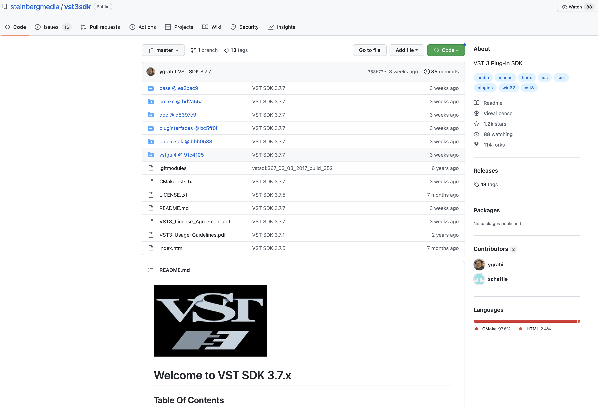

​    下载后，在路径./VST3_Project_Generator/下可以找到适用于不同系统的可执行文件（理论上支持Linux系统，但我在包内没有找到相应文件）：

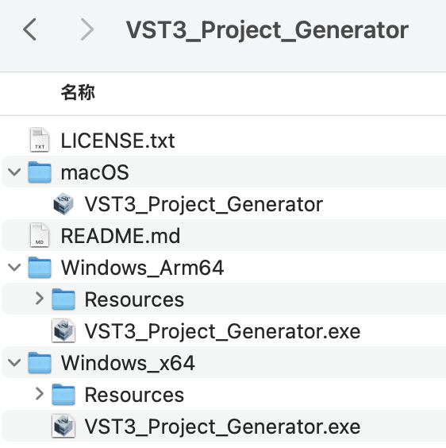

​    此处使用macOS系统，运行后在“Welcome”选项框中选择VST3的SDK路径，并在“Create Plugin-in Project”选项框中输入一些项目相关的信息，包括插件名称(Name)、类型(Type)、Bundle ID(此为MacOS系统的验证码，参考***参考书籍1***的3.2.3内容)以及项目生成的位置和IDE，此处我选择的IDE为Xcode：

​    生成结果：

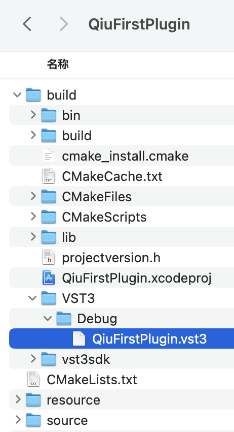

​    如图所示，此处创建了名为“QiuFirstPlugin”的音频插件框架，在框架的./build/VST3/Debug路径下存在一名为“QiuFirstPlugin.vst3“，即.vst3格式的文件，这就是我们经常在宿主里使用的vst3格式。前面提到，这一工程文件是使用了Cmake进行生成的，这里Camke的工作逻辑我没有完全弄懂，但打开Xcode工程文件后界面是这样的：

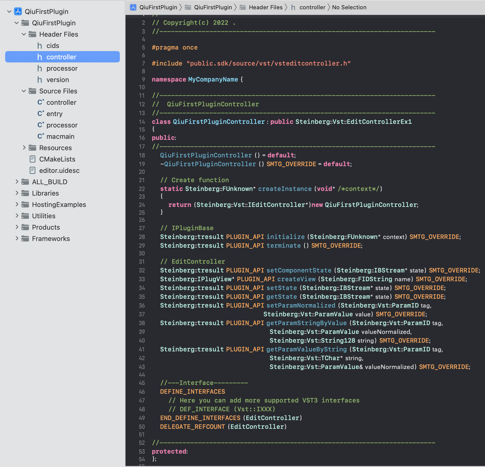

> ​    观察后发现，导入头文件的路径并不存在于“QiuFirstPlugin”这一文件下，却是在Generator的“Welcome”界面中所选SDK的路径下，阅读“CMakeLists.txt”发现有这样一段内容：
>
> 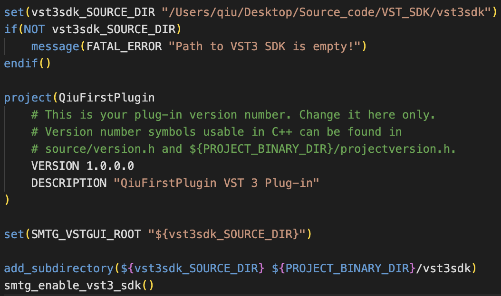
>
> ​    因为对Cmake的不熟悉，之前在查看VST3的构建时一直被vst3sdk这个文件夹给误导，以为所有的可调用函数都在其之下，但是根本找不到任何头文件，感觉非常迷惑。后面查找资料发现add_subdirectory函数实际上实现的是**将项目外部的文件夹添加至build任务列表**，而非把整个文件夹都“搬”到build之下。如此一来便很显然，sdk工具包被添加到./build/vst3sdk路径下，vst3sdk与Xcode文件“QiuFirstPlugin.xcodeproj“在同一目录下，这也是为什么导入头文件时的路径是像图中那样的。
>
> 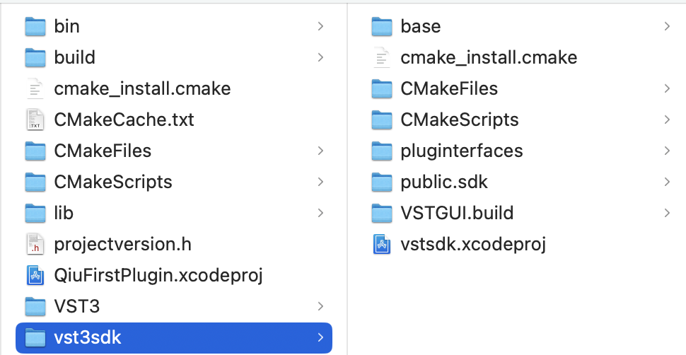

​    在所有的工程文件中，开发者真正需要关注的是“controller.h/cpp“和"processor.h/cpp"这两个部分，其分别对应了GUI和信号处理模块，即插件开发的核心，调整GUI中的Parameters和音频流处理算法之间的映射关系是插件在宿主中工作的基本逻辑。不论什么SDK或者框架，其本质设计思路都是一样的，都是想办法解决GUI和信号处理与宿主之间的交互逻辑来实现插件对音频流的实时处理，而这也是插件开发过程中最实际的工程问题，解决完工程上的实现才能在信号处理模块中实现各种各样效果器的算法，又或者说两者是相辅相成的、密不可分的，不同效果器算法同样会带来各种各样的工程问题，比如CPU占用率、参数调整等等。所谓VST/VST3、AU、AAX等不同的插件格式，其实只是使用的SDK、开发面向的宿主不同，对于设计思路而言没有本质区别。

​    2004年，英国的音频开发工程师*Julian Storer*从其在开发宿主*Traction Waveform*时所使用的底层C++代码中独立出来一部分，设计了现如今音频插件业界开发最常用的框架**JUCE**。JUCE框架拥有自己独立的API且支持导出几乎所有格式的插件文件（当然包括前文提到的VST、AU、AAX等），如此一来，音频开发者们不需要再针对自己需要开发的插件类型专门去熟悉一套SDK（对于大部分人来说这非常耗费时间，比如我自己光熟悉VST3的大部分API调用和使用就不知道要花多长时间，更何况还得针对不同宿主的插件开发学习多个SDK），大大减少了工程上的工作量，而可以更关注插件本身的算法和GUI设计。时至今日，JUCE框架仍然是世界上最常用的插件开发框架。

​    基于上述前提，可以看出，使用什么SDK或者框架并不是插件设计的核心，这些都是换汤不换药的内容，真正重要的是算法和GUI设计以及调用关系，因为*AppDesigner*本身对GUI界面模块化设计的支持，可以无需考虑GUI界面API的使用从而大大减少工作量，因此本次作业更注重的是均衡器算法本身以及GUI组件与算法之间的回调设计。

---

### 二、设计结果展示及相关功能介绍

​    本次作业最终实现均衡器的GUI界面如下所示：

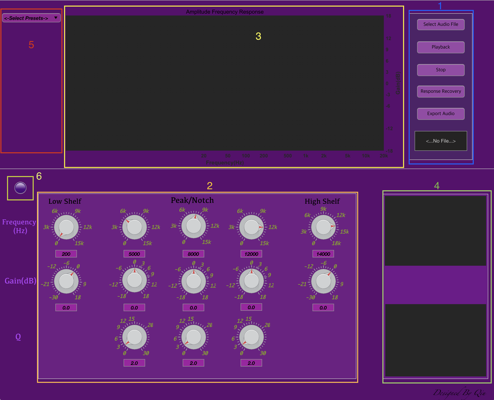

​    其中几个颜色区域的大体功能介绍如下：

> ***区域 1***：音频文件的导入、播放、停止和导出，以及均衡器幅频曲线的复原，同时最下方的黑框会显示导入音频文件的名称；
>
> ***区域 2***：均衡器参数调节，其中中间三个为峰值滤波器，支持Frequency、Gain和Q参数的调节，左右两边均为搁架式滤波器，仅支持Frequency和Gain参数的调节；
>
> ***区域 3***：幅频响应曲线显示区；
>
> ***区域 4***：滤波前后音频的声谱图图像显示(上为处理前，下为处理后)；
>
> ***区域 5***：均衡器预设选择，总共提供了十一个预设参数，其中包括基础类型滤波器(如低切高切等)、特殊音效和音色处理以及基于文献的方向频带增强EQ。
>
> ***区域 6***：显示滤波后音频声谱图状态的信号灯，正常状态为紫色，均衡器只有在点击***Playback***选项时才会更新滤波后声谱图，在改变旋钮参数后而未点击***Playback***更新图像前信号灯会变暗，提醒用户当前均衡器的幅频响应已经改变而尚未更新声谱图图像，当点击***Playback***后，信号灯恢复紫色。

对于多个不同的颜色区域，功能介绍及教程：

> ​    在打开此均衡器后，首先必须要做的是点击***Select Audio File***选项进行音频文件的导入，否则任何操作都会产生错误提醒：
>
> 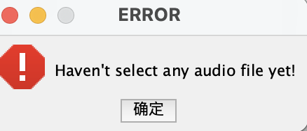
>
> ​    选择完音频文件后(支持wav和mp3格式)，GUI界面中***区域 3和 4***便会分别显示当前音频文件名称和语谱图：
>
> 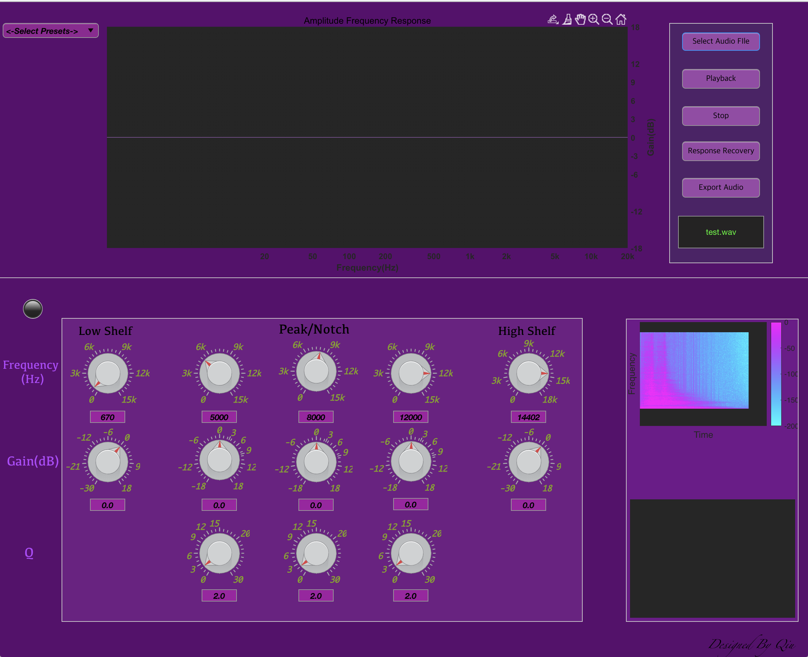
>
> ​    同时上图可以看到，***区域 1***最下方的黑框显示了当前导入音频的名称，***区域 6***的信号灯此时变暗且***区域 4***的下半部分未显示滤波后的信号声谱图。想要显示滤波后声谱图，调节参数后再点击***Playback***选项便会显示(如果不想完整地播放音频，再次点击***Stop***选项即可停止播放)：
>
> 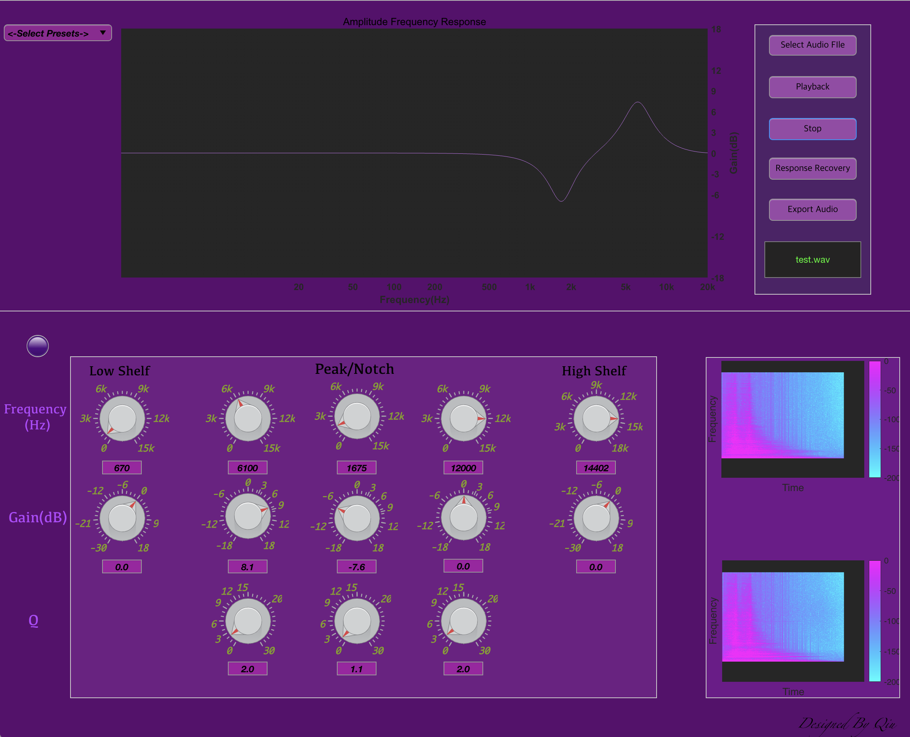
>
> ​    若想让幅频响应恢复原始状态，点击***Response Recovery***选项即可让幅频响应复原，方便用户再次进行参数调节。接下来的内容是参数预设部分即***区域 5***，此均衡器支持的预设总共有11种：
>
> 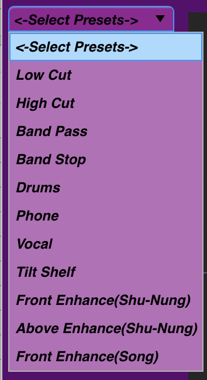
>
> ​    对于预设内容后文会详细介绍，此处只提及如何使用。直接用鼠标选择需要的预设类型，***区域 1***便会加载出预设参数的幅频曲线：
>
> 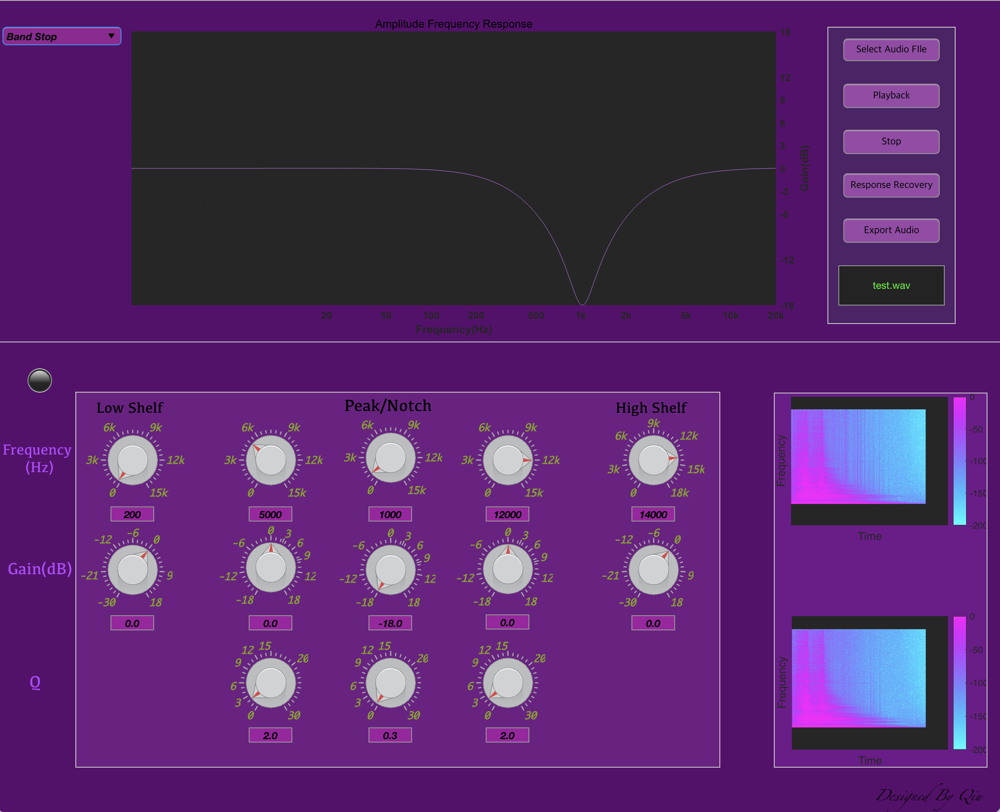
>
> ​    再点击***Playback***选项即可再次更新声谱图。
>
> ​    最后，如果需要导出滤波后的音频文件，点击***区域 1***中的***Export Audio***选项，即可设置导出路径：
>
> 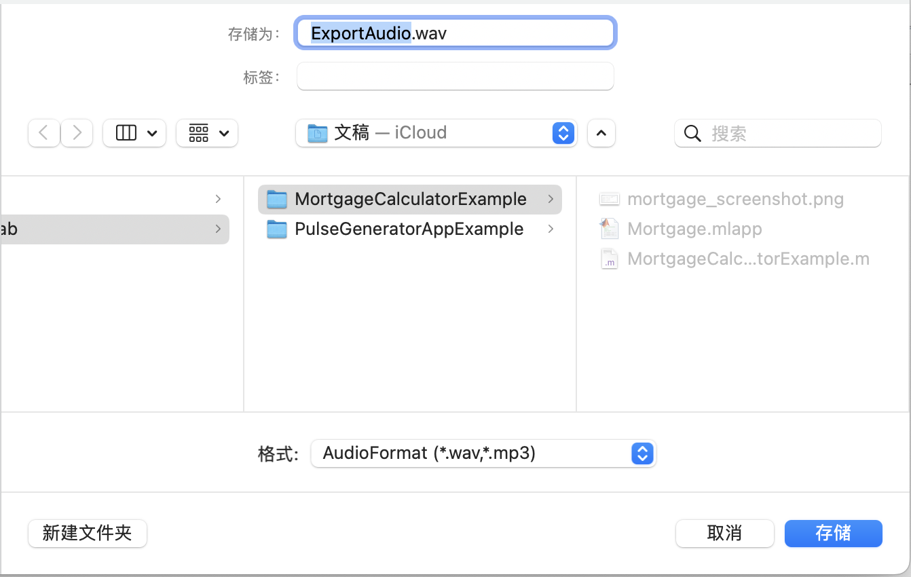
>
> ​    文件的名称和格式可以让用户自己选择(仅支持wav和mp3)，选择好路径、名称和格式后点击储存即可导出音频
>
> 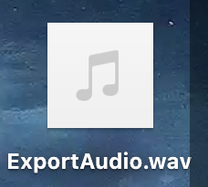

​    以上内容即此均衡器支持的全部功能介绍，因为只是一次对插件的试水，没有设计过多内容而是专注于设计思路的梳理还有对细节的理解与打磨，前文中我也提到了关于VST3和其它SDK开发插件的相关内容，主要目的在于用*AppDesigner*来实现类似的效果，后文将详细介绍如何利用*AppDesigner*自带的方法来实现这一目的。

---

### 三、设计过程及部分知识总结

​    *AppDesigner*是MathWorks于Matlab R2016a版本加入的App，其支持用户直接拖放可视化组件以布置GUI界面，并使用集成化编辑器对其行为进行快速编程，在此之上，用户还能使用*Matlab Driver*进行工程共享，或者使用*Matlab Compiler*和*Simulink Compiler*创建独立桌面或网页端应用程序。无论是网络论坛还是MathWorks官网都给出了详细的相关教程和文档，哪怕是*AppDesigner*本身也内置了多个工程文件和教程，力图手把手教会用户其基本使用方法。

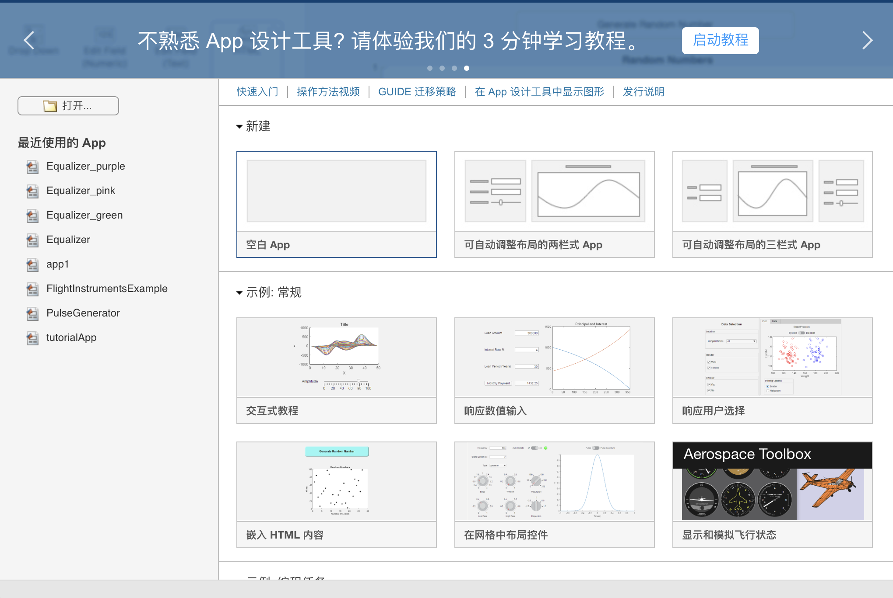

​    而正如介绍所述，其GUI设计对于初学者而言非常友好，拖放式的图形化界面，*AppDesigner*会根据用户在图形化界面中的编辑自动生成相应的代码，无需额外学习GUI界面设计的各种函数调用，可以把注意力完全放在算法实现和调用上。*AppDesigner*把GUI和算法之间的参数传递称为“回调”，组件之间的回调设计就是整个均衡器设计的核心内容。对于一个功能较为完整的均衡器而言，需要支持的基础功能在撰写选题说明时就已经提及过，主要包含以下几个部分：

> *1、可调频点；*
>
> *2、可调增益；*
>
> *3、可调 Q值(带宽)。*

​    由此初步设计出整个滤波器GUI界面的大体框架：

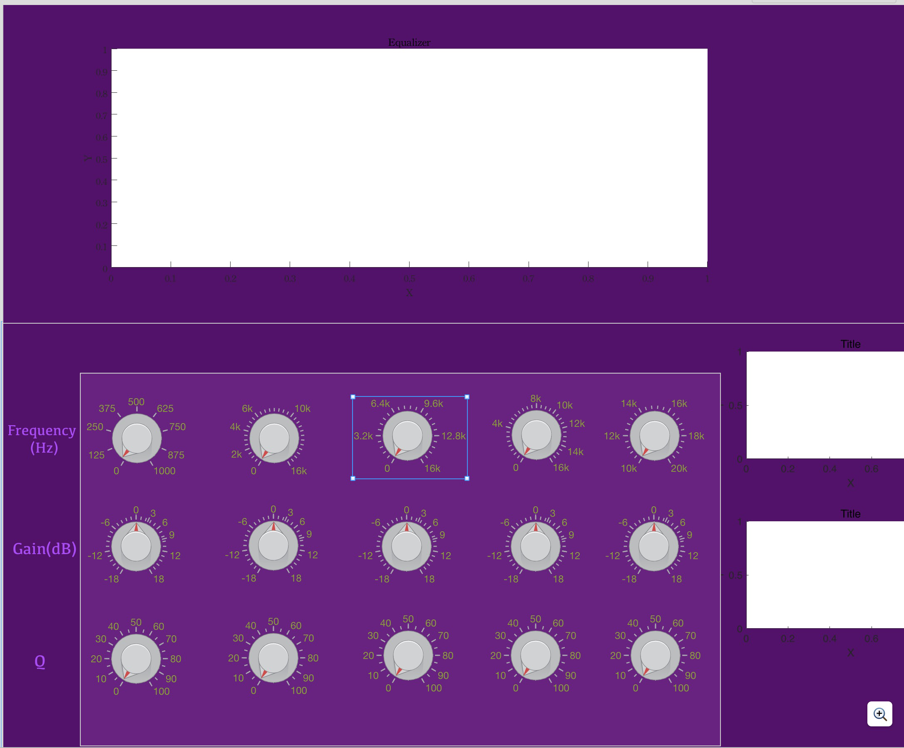

​    如上图所示，GUI界面的大体框架主要包括几个部分：1、显示幅频响应的坐标区；2、分别显示音频文件滤波前后的语谱图的坐标区；3、基础参数调节区。其中，参数调节区经过后续修正，中间三个滤波器设计为**Peak/Notch Filter**，左右两个滤波器设计为**Shelf FIlter**，且分别为低频和高频搁架式滤波。

​    对于Frequency、Gain和Q三个参数与均衡器幅频曲线之间的映射关系，这里参考了***参考书籍2***第二章的相关内容，即如何设计峰值和搁架式滤波器：

​    本次设计均衡器均基于上述参数，可以看到其中峰值滤波器的最终频响由Frequency、Gain和Q三个参数决定，而搁架式滤波器仅由Frequency和Gain两个参数决定。因此在最终设计均衡器的GUI界面时也考虑到了这一点，只对中间的三个滤波器设置了Q值的调节旋钮。

​    最终将三种类型的滤波器(即峰值滤波器、低频搁架式滤波器和高频搁架式滤波器)的系数算法分别封装在*PeakFilter_Designer*、*LowShelfFilter_Designer*和*HighShelfFilter_Designer*三个函数中，并在*generateFrequencyResponse*函数中调用三者，根据当前旋钮参数得出当前要显示的均衡器幅频响应曲线(其中传参BufferSize是因为本来想做实时信号处理用于设置音频流帧长，其主要决定的是幅频响应的频谱分辨率，但后面因为一些实现上的问题因此废弃，整个文件中的BufferSize都默认为1024，对应幅频响应的频谱分辨率为$\frac{sr}{1024}$)。

​    而到目前为止，仅仅只是实现了如何捕获GUI界面上旋钮的参数用来算幅频响应，并没有真正实现可以像一般宿主里的均衡器一样，可以一边调整GUI界面里的旋钮一边查看幅频曲线，这就不得不提到*AppDesigner*中的“回调”概念了。在*AppDesigner*中，只要在GUI界面中创建了一个组件，点击此组件在选项框中就会有如下选项：

​                         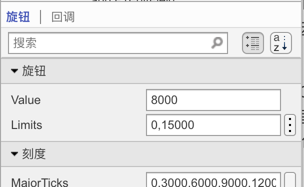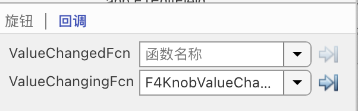

​    可以看到一般旋钮的“回调”分别有*ValueChangedFcn*和*ValueChangingFcn*两种类型，而它们的区别也十分好理解，前者是在用户对GUI界面中的组件进行参数调整**结束**(表现为按住旋钮-->调节参数-->放开旋钮)的时候将当前组件的参数进行传递(即**只进行一次回调操作**)；后者是在用户对组件进行参数调整时实时进行参数传递，即只要用户正在改变组件参数，该组件就会不断地传递参数(即**实时进行回调操作**)。这两种回调方法带来的效果完全不同，以幅频响应的坐标显示为例，我在method中定义了一个*updataPlot*函数用于更新显示的幅频曲线图像，实现方式非常简单：

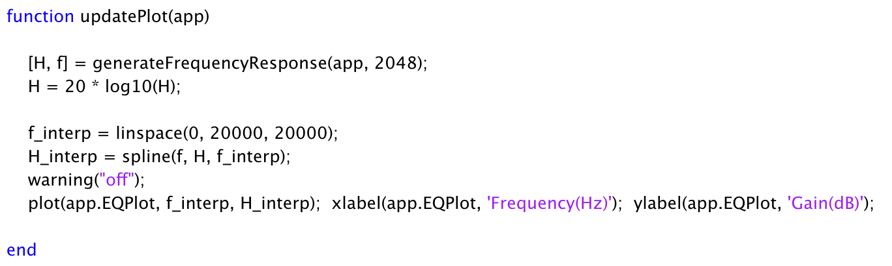

​    利用上述提到的*generateFrequencyResponse*函数根据当前GUI界面各组件参数计算出对应的幅频响应曲线，取对数后进行一次**spline**插值让曲线更加平滑，然后直接对*app.EQPlot*进行图像的绘制。但这整个函数对幅频响应的绘制仅仅只是单次绘制，想要像一般的均衡器那样，调节GUI参数的同时能实时看到频响曲线的变化，就要用上面提到的*ValueChangingFcn*回调方法，否则GUI只会在用户调完参数并放开组件时才进行图像的绘制，这样根本无法得到自己想要的频响曲线。只要使用*ValueChangingFcn*回调方法，每个组件的回调传参就非常简单了，此处以低频搁架式滤波器的频率调节旋钮的回调为例(其它旋钮组件的回调逻辑均一致)：

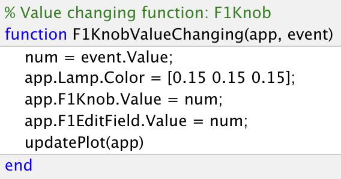

​    这里只要直接获取当前回调结果，并将其赋值给*F1Knob*组件，用前文提到的*updataPlot*函数进行图像的更新。在调节参数时坐标区*EQPlot*就会因为实时的回调操作而不断更新幅频响应曲线，从而实现频响调节可视化。其余旋钮组件回调方法与此完全一致，且均支持频响曲线变化实时显示，至此，完成了***区域 2***与***区域 3***之间的逻辑设计。

​    

​    ***区域 1***的各按钮功能实现方法各不相同，其中，***Select Audio File***使用了Matlab自带的uigetfile函数，其可以直接打开一个路径选择框从而供用户选择需要导入的音频文件，并且为了在function之间传递参数(如文件路径)，使用了*AppDesigner*中组件的*UserData*属性，将特定的参数对其进行赋值即可在全局进行调用从而实现函数之间参数的传递。在***Select Audio File***按钮的回调函数*SelectAudioFileButtonPushed*中就使用了这一方法将选择的文件路径进行传递以供后续的回调函数使用。***Playback***选项的回调函数为*PlaybackButtonPushed*，其获取由*SelectAudioFile ButtonPushed*函数传递的文件路径再次进行audioread，并利用前文提及的method中的*generateFrequency Response*函数得到当前均衡器的幅频响应函数，由iff和ifftshift函数得到脉冲响应函数与读取的音频信号进行卷积，所得结果即滤波后的音频信号。为了针对立体声音频的滤波与重放，此处还多加了一步：

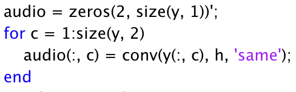

​    如果读取的音频为立体声格式，则会用脉冲响应函数分别与左右声道进行卷积，最终用sound函数重放出来的音频依然是立体声，保留了不同声道的信息。同时为了方便后续的导出操作，回调函数还会将滤波后的音频信号存入*app.ExportAudioButton.UserData*中。可以看出，*PlaybackButtonPushed*函数同时包含了音频读取、幅频响应计算、音频滤波、重放和滤波结果的存储多个步骤，是所有回调函数中最重要的一个，因此这也是为什么专门设置了***区域 6***来表示用户当前是否点击***Playback***来更新均衡器状态。

​    ***Stop***选项相对而言就非常简单，因为只是需要停止播放，前面用sound函数来播放音频这里只需要用clear函数即可停止回放。而***Response Recovery***选项是通过调用参数初始化函数来实现的，在*AppDesigner*的项目中，存在一个*starupFcn*函数，其中可以设置所有旋钮的初始参数：

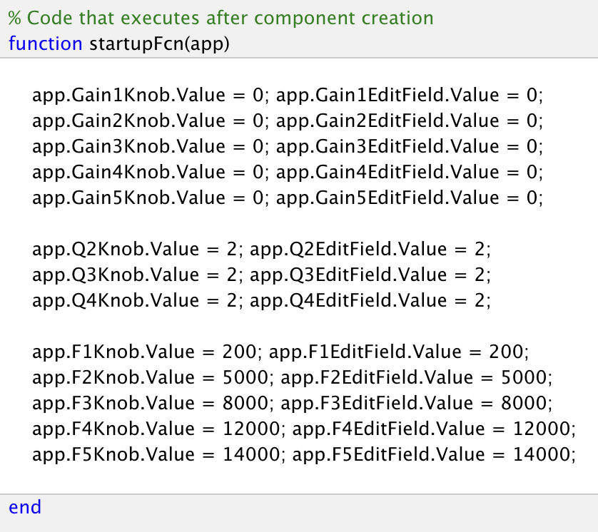

​    而*ResponseRecoveryButtonPushed*就是通过调用*starupFcn*函数将所有旋钮的参数进行初始化设置，并用*updataPlot*函数更新幅频曲线图像即可还原频响。***Export Audio***函数与***Select Audio File***类似，使用了Matlab自带的uiputfile函数，这一函数支持打开一个路径选择框，用户可以选择特定的路径，并自定义保存文件的名称和格式(同样仅支持wav和mp3)，这里为了使用audiowrite函数进行音频文件的输出，需获取原始音频文件的采样率，只需要使用之前传递的*app.PlaybackButton.UserData*用audioread即可再次获取音频采样率，前文提到，在*PlaybackButtonPushed*中储存了滤波后的音频信号数据，这里只需要获取一下就可以直接进行输出：

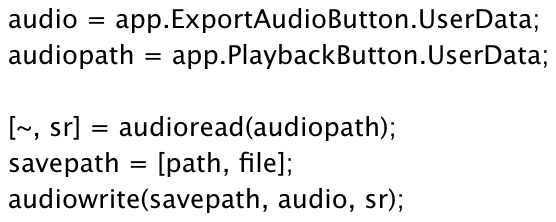

​    以上即***区域 1***的全部实现过程。

​    对于***区域 4***的设计经过了多种尝试，一开始是尝试用*spectrogram*函数来画获取短时傅里叶变化结果和作声谱图，但是存在诸多问题：1、*spectrogram*函数无法像*plot*那样指定画图区域；2、*spectrogram*函数会自动画图，并且因为无法控制目标区域会导致由GUI界面跳转到一个单独的图像界面。因此放弃了使用*spectrogram*函数。

​    幸好Matlab提供了普通的*stft*函数(注意：需要在Matlab R2019a即后续版本才有这一函数，如果版本较低可能会导致这一步运行失败！)，而对不同的画图函数也进行了诸多尝试，比如*mesh*函数、*waterfall*函数等，但这些函数或多或少在图像显示上都存在一定问题，无法满足我预期的结果。最后经过多次比对，最终还是决定使用*imagesc*函数进行声谱图的绘制，*imagesc*函数可以指定绘制区域，用颜色盘来表示z轴幅值大小，并且使用者可以自定义颜色盘，官方也提供了不少颜色盘选择，可以自由根据GUI界面的配色选择或自定义颜色盘，可以说是实用性与外观的最佳决定。

​    我将声谱图的绘制过程封装在了method中的*meshPlot*函数，基于参数num其分为两种绘制模式，num=1时图像绘制在*app.OriginSpectrum*中(即滤波前图像区域)，num=2时则绘制在*app.ProcessdSpectrum*中(即滤波后图像区域)。在***Select Audio File***选项的回调函数*SelectAudioFileButtonPushed*调用了*meshPlot*的第一种绘制模式，因此在用户导入音频后，*app.OriginSpectrum*会产生原始音频的声谱图而*app.ProcessdSpectrum*不会；用户点击***Playback***选项仅会对*app.ProcessdSpectrum*进行绘制，这是因为*PlaybackButtonPushed*函数中调用了*meshPlot*的第二种绘制模式。以上内容即***区域 4***的整体实现过程及思路。

​    最后***区域 5***，即预设参数，实现方法比较简单，直接对旋钮参数进行赋值然后调用*updataPlot*即可。所有的预设曲线均通过调节均衡器本身的参数来得到，对于不同预设的介绍如下：

> **Low Cut**
>
> 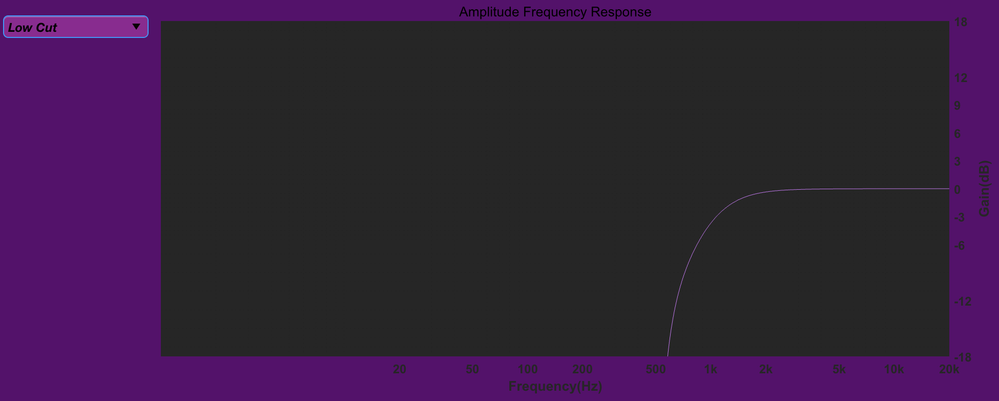
>
> *说明：简单的低切滤波器，用来过滤低频分量。*

> **High Cut**
>
> 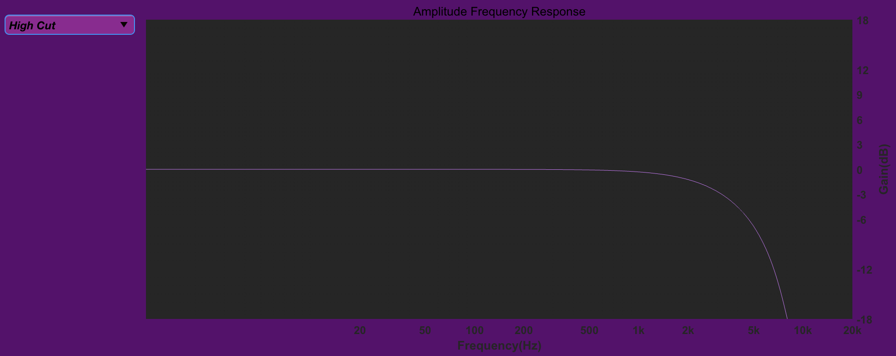
>
> *说明：简单的高切滤波器，用来过滤高频分量。*

> **Band Pass**
>
> 
>
> *说明：一带通滤波器，形状比较类似梅尔滤波器组中的三角滤波器。*

> **Band Stop**
>
> 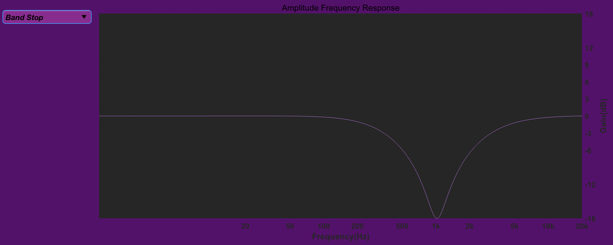
>
> *说明：一带阻滤波器，也可称之为陷波器(Notch Filter)，通过调节中间三个滤波器的任意一个的Gain值大小(为负数)可以轻松得到这一频响。*

> **Drums**
>
> 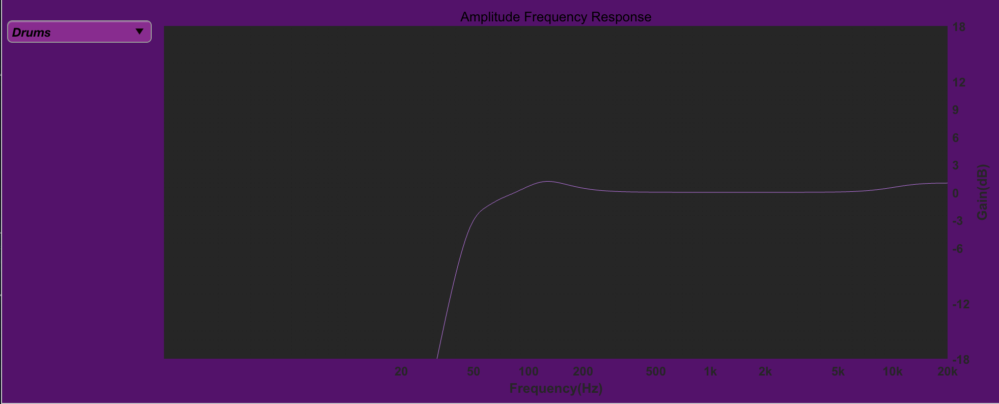
>
> *说明：来自Fabfilter厂家的均衡器Q3的预设，这是一个用来处理底鼓的曲线，一定程度上提高50～150Hz的能量并去除人耳可闻频率范围(20Hz以下)的能量从而保留更多有效信息，这也是混音中常用的提高响度的方法，在保证电平大致不变的前提下去除无效频率分量可以适度提高对音色有用的频率幅值，从而提升响度，也能一定程度上提嘎底鼓的力度。与此同时还略微做了一个高通，虽然底鼓的频率集中在低频，但是稍微提升其高频分量也能一定程度上让底鼓“更容易听到”或者说提高其明亮度。*

> **Phone**
>
> 
>
> *说明：同样也是来自Fabfilter厂家均衡器Q3的预设，这一曲线用来设计“电话音”音效，也是十分常见的一个处理效果。*

> **Vocal**
>
> 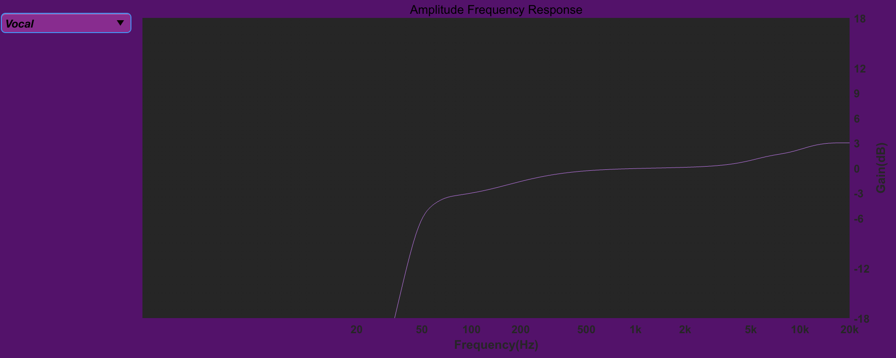
>
> *说明：也是来自Fabfilter的Q3的预设，用来处理人声，主要目的在于提升人声的明亮度。*

> **Tilt Shelf**
>
> 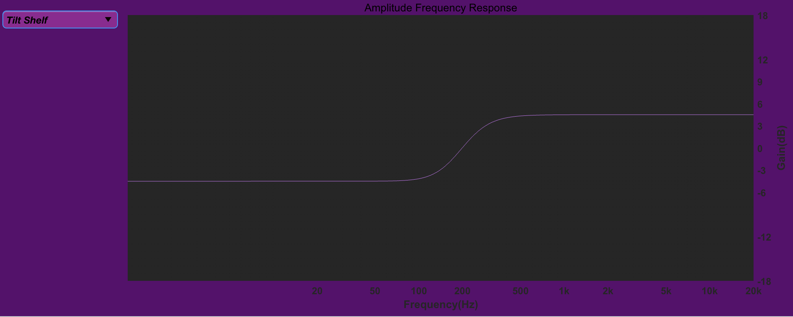
>
> *说明：这是一个比较有趣的曲线，其相当于由一个高频和低频搁架式滤波组成，也是EQ曲线中非常经典的一种类型。*

> **Front Enhance(Shu-Nung)**
>
> 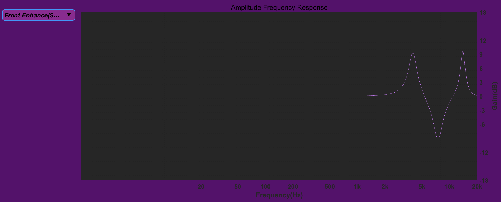
>
> *说明：这是取自于**HRTF Adjustments with Audio Quality Assessments, Shu-Nung YAO(1), Li Jen CHEN(2)**这篇文献的前向声源增强EQ曲线，其原文还给出了上方和后方增强的曲线，但是后方增强曲线普遍需要四个峰值滤波器，本次实现的均衡器能调用的只有三个，所以后方声源增强均未在预设中设置。*

> **Above Enhance(Shu-Nung)**
>
> 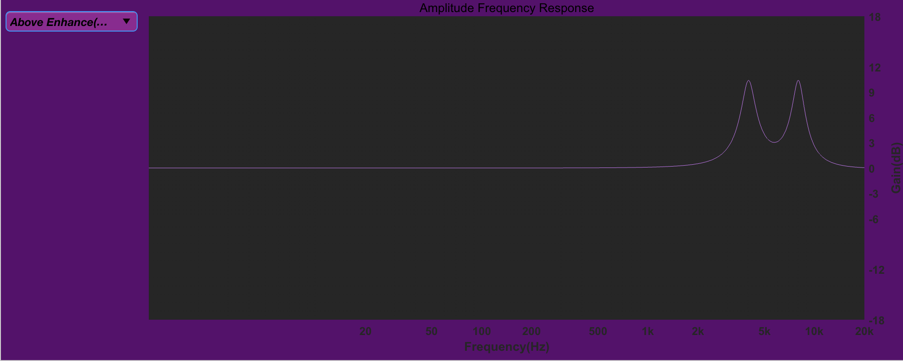
>
> *说明：如上所示，也是取自于上面那篇文献中的EQ曲线，此为上方声源增强曲线。*

> **Front Enhance(Song)**
>
> 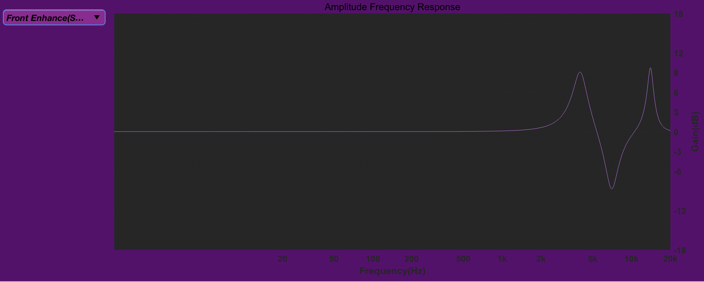
>
> *说明：这是取自**Externalization Enhancement for Headphone-Reproduced Virtual Frontal and Rear Sound Images, Song Li(1) , Roman Schlieper(1) , and Jürgen Peissig(1)**这篇文献的前向声源增强曲线，同样的，这篇文献也有后方声源增强，但是需要四个峰值滤波器，因此预设中未给予实现。*

​    上述提及的Fabfilter插件Q3的预设曲线如下所示：

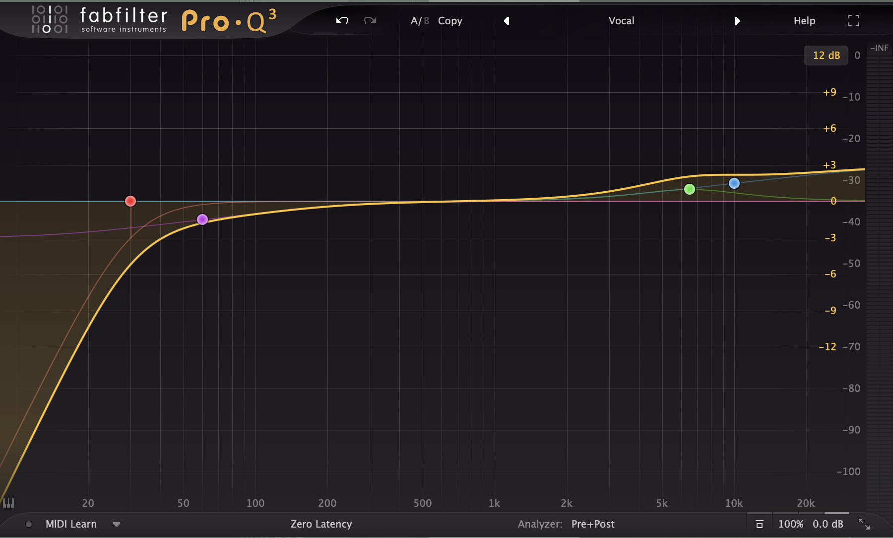

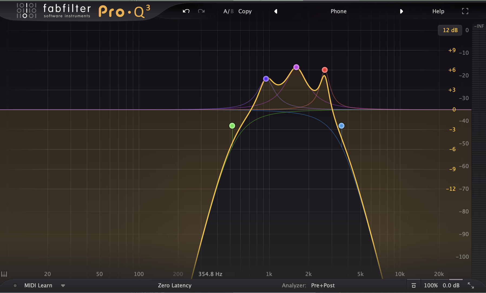

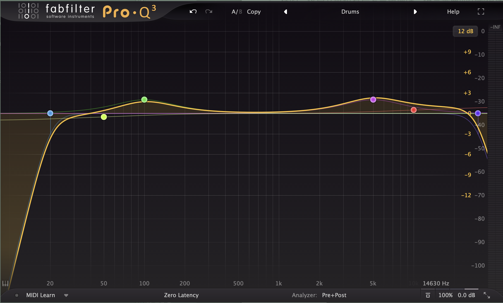

​    而在上述提及的文献中，其原文相关参数和曲线图像如下所示：

​               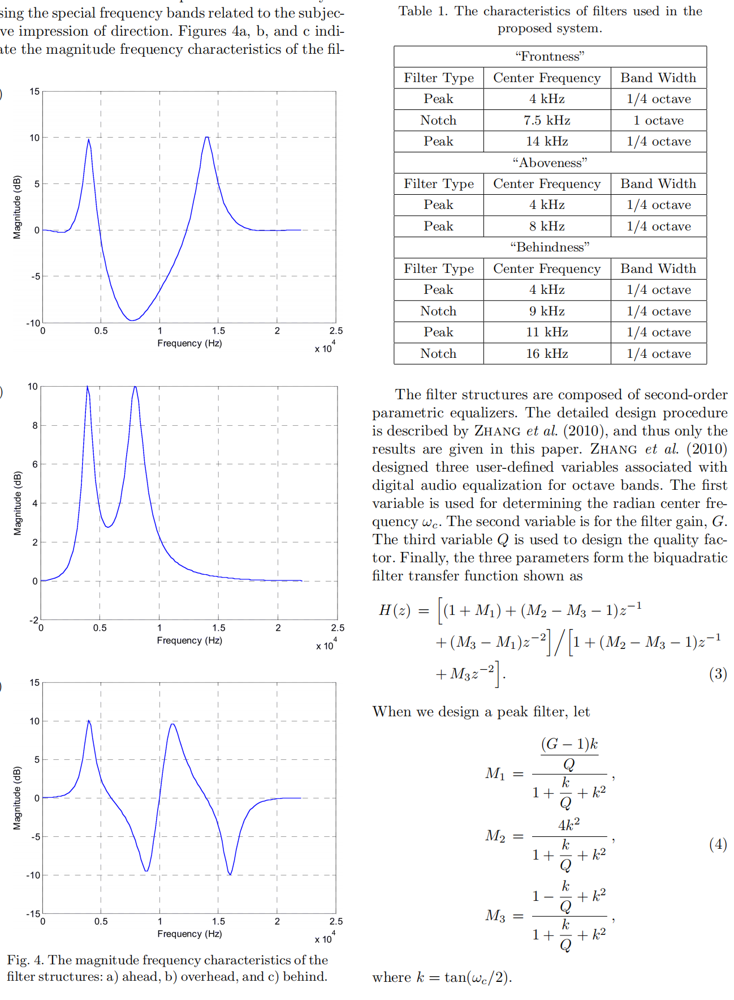

​    以上即***区域 5***预设内容的全部设计来源和思路。

​    至于***区域 6***即信号灯，调用方式比较简单，且功能和作用在前文已经讲述的比较详细了，此处便不再单独赘述。

​    

​    **以上即此均衡器的全部设计流程和部分相关知识点介绍。**

---

### 四、未能实现的功能及相关探究内容汇总

​    前文讲述了当前均衡器已经实现的功能和设计方法，但在设计初期，原本的构想和最终成品并不一样，有一些想法在进行了大量的调研、探究和实验后仍然未能成功实现，总结下来可能跟细节的优化有很大关系，虽然没能实现但整体思路还是有很大的进展的。为了确保最终成品的稳定性，因此没有把这些内容加入到其中，而是选择在报告中进行知识性汇总，希望能对后面的学习和探究有一些阶段性的启发，也算是对这段时间的调研内容的一个汇总和反思。

​    未能实现的功能主要有两个：**1、音频流实时处理**；**2、线性相位均衡器**。

#### 1、音频流实时处理

​    对于宿主而言，其导入的音频都是支持在不同位置随播随停的，且一次性读取整段音频信号再用插件进行信号处理并不现实。因此对于插件处理音频往往有*“Buffer Size”*的概念，即***缓冲区大小***。其代表插件进行一次处理前需要先采集到的采样点数量，如果使用较小的缓冲区大小，对于相同的音频采样率，CPU每秒钟需要进行的插件处理运算可能会多出来数倍。而使用较大的缓冲区大小会引出了*“Audio Latency”*的问题，即***延迟大小***。缓冲区、延迟和采样率之间的换算关系如下：
$$
Latency=\frac{Buffer Size}{SampleRate}
$$
​    比如对于48kHz采样率、缓冲区设置为1024的情况，此时引入的延迟大小就约为$1024/48k=21.33ms$。而这也很好理解，缓冲区代表“插件需要收集的采样点”，采样率代表“每秒的采样点”，因此$1/SampleRate$代表的就是每个采样点占用的秒数，其与Buffer Size相乘就等于每个缓冲区占用的时间了，即**为了收集满足Buffer Size大小数量采样点**所消耗的时间，也相当于引入的延迟大小。如果缓冲区设置的极小，那么Latency自然就小了，但是每秒钟插件需要处理的运算也变多，会带来更高的CPU负载率；如果设置的极大，每秒钟需要处理的运算也相应变小，但是会引入更多的延迟。因此往往Buffer Size都是根据用户的需求自行折中设置。

​    在此基础上，想要对音频流进行滤波操作时，很明显的一个问题就产生了：**脉冲响应与任意大小Buffer Size的音频数据块进行卷积所得结果肯定都大于其原始大小**。这样一来，每个音频块进行滤波后都会多出来一块数据，如果直接去掉，对于脉冲响应点数较多的情况无疑会带来严重的失真，且相邻块之间也可能会存在跳变，带来可闻的“咔哒”声等问题。经过查阅资料，找到了一个看起来较为可行的解决方案，其所针对的场景也是实时音频信号处理：

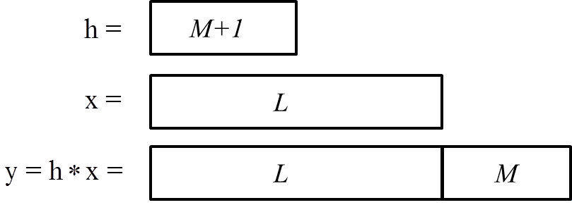

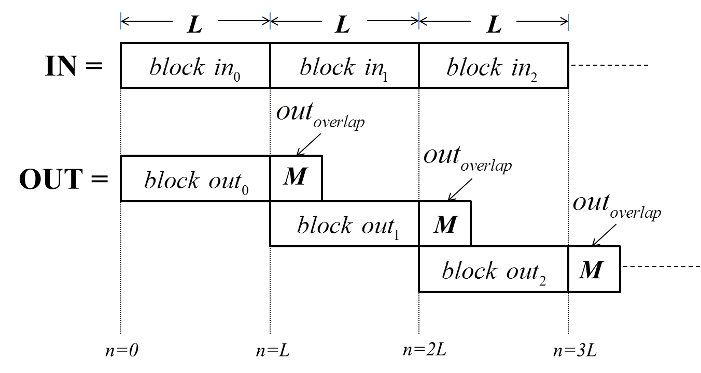

​    其解决方案相当简单粗暴，直接将多余部分的音频数据叠加到下一个音频块的开头，这样每个音频块的输出都是当前缓冲区的滤波结果和上个缓冲区的滤波结果的叠加，这样既防止了数据丢失也增强了块与块之间的相关性。

​    但是真正阻碍我实现音频流实时处理的并不是这个问题。对于Matlab而言，其有专门对音频文件以音频流形式读取的函数*dsp.AudioFileReader*：

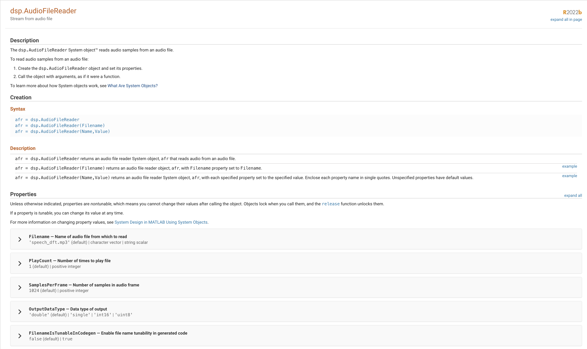

​    其以前文所述那样以音频数据块的形式对音频文件进行读取，指定好音频文件路径后返回的对象可以用循环调用和*~isDone()*判断的方法进行数据块的依次获取。但在实际使用过程中，虽然能够顺利创建对象、读取数据并进行相关操作和回放，但是会产生非常严重的问题：

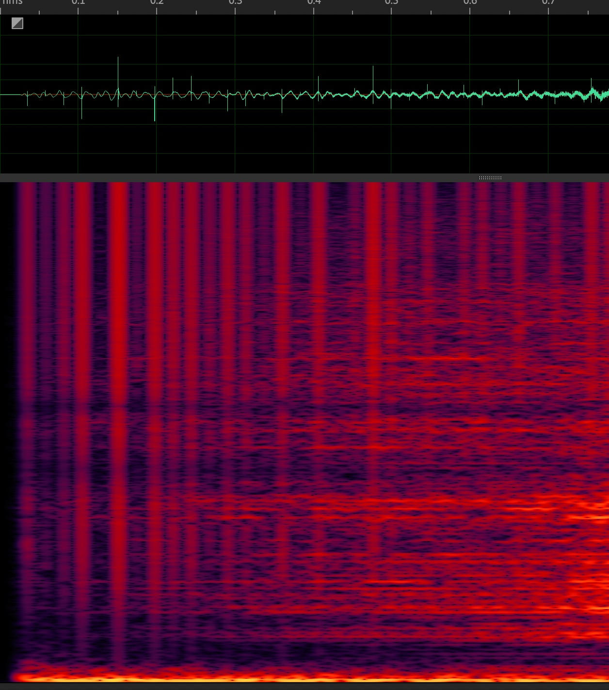

​    如图所示，在数据块之间产生了非常明显的跳变，听感上就是源源不断的“咔哒”声，即便我使用了前文提到的解决方案，依然无法正常处理。也许是因为Matlab的*dsp*模块本身没有考虑过这种情况导致，使用JUCE此类专门开发音频插件的API，便无需考虑也不会出现这些问题，直接使用特定的函数进行滤波操作即可。

​    综上所述，对于实时音频流处理虽然解决方案和实现方法大致有所了解，依然还是存在无法解释的问题。所以在最终编写代码时，是用*conv*对整段音频进行滤波再用sound函数直接播放的操作，也因此无法实现音频流的随时播放与停止，只能整段回放，停止后再从头开始播放。即便如此，仅对于测试均衡器的滤波效果也完全足够了。

#### 2、线性相位均衡器

​    研究如何实现IIR滤波器的线性相位是曾经(二十世纪后期与二十一世纪初期)在学术界和工业界都十分盛行的一个问题，提出的方法也非常之多，主要思路有基于**全极点IIR滤波器**的设计方法、利用**全通滤波器进行相频响应的补偿**等等，而其中用全通滤波器进行补偿是最为广泛和实用的方法。

​    在此之前，需要先补充一些关于滤波器线性相位的相关内容。我们都知道，FIR是线性相位的滤波器结构，从传递函数在Z平面零极点分布的角度来看，FIR滤波器的幅频响应主要依靠零点来改变，其极点均处于Z平面的原点位置。使用Matlab的滤波器设计APP设计一任意FIR滤波器，观察零极点可知：

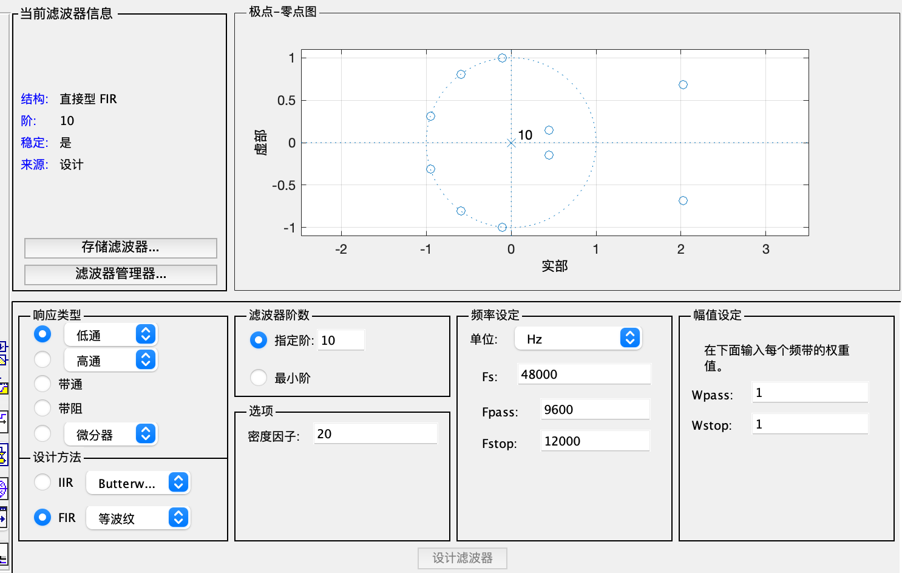

​    因此不能说FIR滤波器“不存在极点”，FIR只是极点均处于原点罢了。除此之外，FIR滤波器的零点分布还存在一个很重要的特征，这也是真正决定它相位保持线性的原因：

>​    对于FIR滤波器任意不处于单位圆上的零点$z_i$，必然在Z平面的$1/z_i^*$位置也存在一个零点，。为了更方便计算，对于任意虚数有：
>$$
>\frac{1}{z}=\frac{z^*}{|z|^2}
>$$
>
>$$
>=>\frac{1}{z^*}=\frac{z}{|z|^2}
>$$
>
>​    即FIR**任意零点必然存在另一个与之成共轭倒数关系的零点(单位圆上的零点其本身就满足这一条件)**，式子经过转换后看出共轭倒数可由零点除以其模平方得到。

​    无论是FIR还是IIR滤波器，其幅频和相频响应与零极点分布之间的计算关系是一致的。因此如果想让滤波器满足线性相位，这是任何结构都必须遵守的条件，与什么结构的滤波器无本质关系。但是IIR滤波器真正无法满足线性相位的原因很简单：**其极点并不全都分布在原点**。IIR滤波器要满足系统稳定只需要保证极点在单位圆内即可，但是如果要满足还存在另一个共轭倒数位置的极点，必然会导致处于单位圆外，即系统无法保持稳定。这也是IIR无法满足线性相位的核心原因。

​    但是有了全通滤波器，就可以在一定程度上改善这一问题，全通滤波器的零极点特征为零点和极点两两关于单位圆对称，我碰到问题的地方也正是这里：1、全通滤波器也无法让极点处于单位圆外，这样依然无法补偿IIR滤波器的共轭对称极点；2、全通滤波器本身零极点也有一定限制，在对IIR滤波器补偿时可能会产生新的不满足条件的零点/极点，此时需要解决的问题就变的更复杂了。而在网上查阅的大量资料也并无着重讨论这一问题，往往只是说了前文所诉的一些基本思想，实现细节并未详细展开。所以线性相位均衡器我也卡在这里了，暂时无法解决这一问题，只能留待后续继续钻研。

​    顺带一提，前文所使用的Fabfilter厂家开发的Q3插件支持线性相位，查阅其官方资料后得到如下内容：

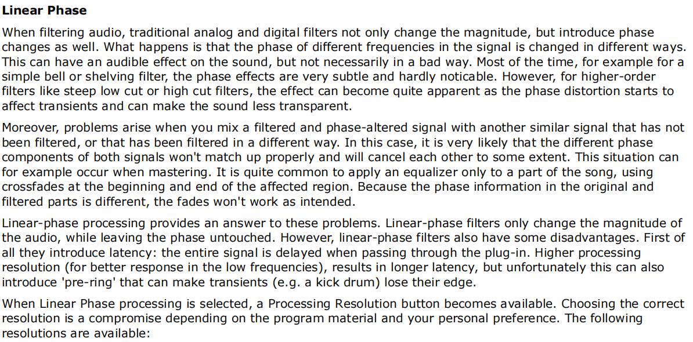

​    可以看到，在使用线性相位滤波时不仅会产生较大的处理延迟，还会产生一个叫做“预振铃”的现象，尤其是对于像底鼓这种瞬态较强的音色。在Q3中选择*Linear Phase*模式后会出现如下选项：

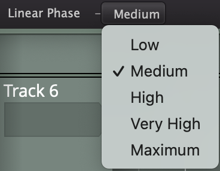

​    原文中称其为*“Processing Resolution button”*，各选项的详细介绍为：

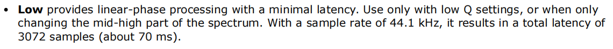

​    可以看到，这里的选项主要决定的是低频的分辨率大小，而随着低频分辨率越高，带来的延迟和“预振铃”问题也就越严重。

​    由此说明书中的叙述，我初步推断，一般插件中的线性相位的实现方法依然是通过全通滤波器来补偿，否则不会引入这么多延迟和频域分辨率问题，其提高频域分辨率的方法可能就是在**提高全通滤波器的阶数**，如此一来自然会带来严重的处理延迟(因为结构更加复杂，需要进行的运算成倍增加)；但还有另一种可能，联想前文中的式(1)，插件处理的Latency和Sample Rate之间的关系是存在公式换算的，而变量就是Buffer Size，Q3中的*Processing Resolution button*也有可能**改变的是插件处理的Buffer Size**，提高Buffer Size同样可以提高频域分辨率(单个音频块采样点变多，相应频域分辨率也会变高)，也会带来延迟问题，而所谓的“预振铃”可能就是单个音频块采样点变多导致瞬态响应因为某种原因被衰减。但这些都仅仅只是我个人猜测，并没有实际文献或者书籍来支撑。

---

### 五、总结

​    本次结课作业初步探究了插件设计的基本逻辑和思想，也了解了一些插件开发相关的架构和工具包，并且对实时信号处理和效果器算法相关知识也有不少学习，总体来说收获颇丰。虽然也产生了不少仍待进一步解决的问题，有问题才有进步，希望能在后续进行更深刻地学习和理解。

​    *AppDesigner*这一应用程序提供了非常棒的GUI界面与算法交互设计，其简洁、可视化的编程方式对于新手而言非常友好，各种可自定义外观的拖拽式组件也让我得以设计出一个相对满意的GUI界面。组件之间的“回调”方法一开始感觉比较困惑，但慢慢理解后才发现有多简便好用，Mathworks不留余力的封装为开发者省去了大量麻烦。

​    综上所述，本次作业完成结果我个人较为满意，有思考、解决问题的体验也有大量的收获，希望在2023年，可以进一步学习更多效果器开发和算法相关的知识，编程能力也能更上一层楼。

