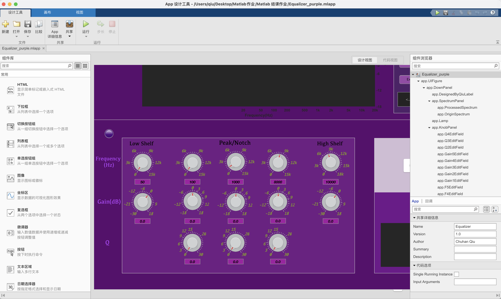
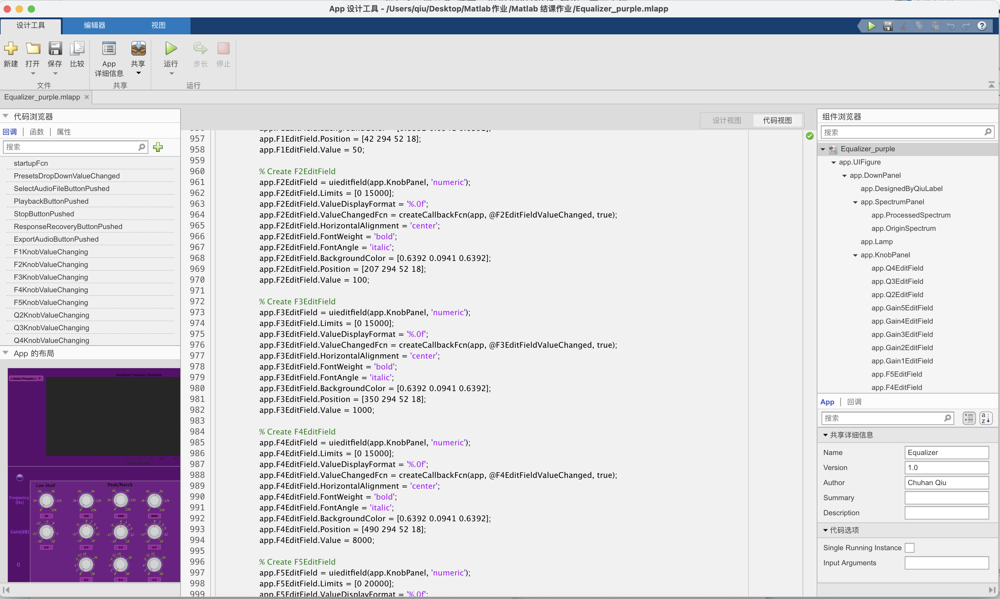
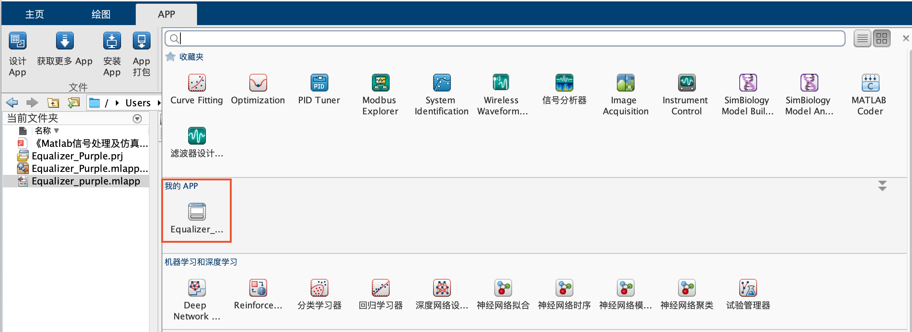

# 运行说明

*撰写人：邱楚寒  学号：2020209023026  班级：录音工程*

​    在Matlab中进入当前文件路径，直接运行*Equalizer_purple.mlapp*，Matlab会自动用*AppDesigner*打开工程文件，可以详细查看所以GUI界面和内部算法的实现代码：

​    点击“设计工具”栏中的“运行”选项保存修改内容并进入GUI界面，根据报告中的操作步骤说明正常使用即可。

   

​    若不想查看工程内容，只想测试均衡器效果，双击当前文件夹内的*Equalizer_Purple.mlappinstall*，Matlab会对应用进行安装，然后在Matlab主界面中APP栏位“我的APP”中显示均衡器成品，点击运行即可。

