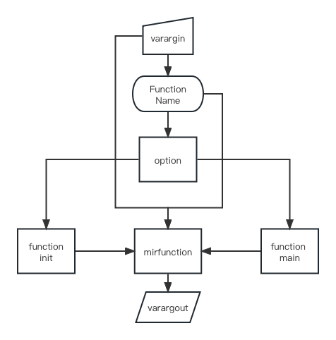
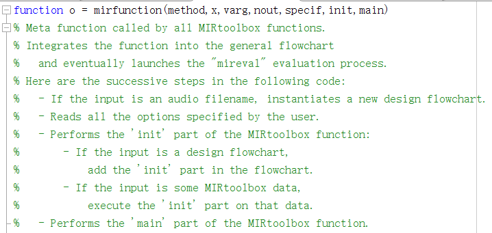
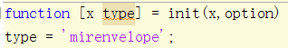

# Audio Program Design and Application - 1

*Reporter : Chuhan Qin  Student Number : 2020209023026  Major : Recording Engineer*

  Before the main body of this report, I wanna talk about the structure of MIRToolBox 's functions first.

  From the source code of MIRToolBox, that's pretty obvious that all the functions of it have the same structure as the following diagram:

  Some of them may also include the 'function post' in their implementation, but the above diagram clearly shows how most functions of MIRToolBox are implemented in Matlab. Obviously, 'mirfunction' really plays an important role in the whole tool box, as it was annotated at the beginning:

  It is a 'meta function called by all MIRtoolbox functions'. In the 'varargin-varargout' part, MIRToolBox uses a structure variable named 'option' to storage all the input variables given by users, and the 'option' would become the member of another structure variable named 'specif'. Then, all of them would be the input parameters of mirfunction. Besides,  function's initialization would define its type, resembling the mirenvelope's type is the same as its name:

  And the main part of its definition would also be the input parameter of mirfunction. I have tried to use the same structure to implement a function, but it didn't work, it seems that there are still many other details inside the MIRToolBox. The failed file is named 'Test_envelope_extractor.m', which could also be found in the 'function' folder.

---

  In return, our main aim in this report is to extract the envelope and fundmental frequency of different audio signals based on MIRtoolbox. Besides, we need to implement the Notes Seperation of single sound source in one period, which demands us to extract the onset and decay locations of all notes. 

  I have encapsulated three functions in my homework folder, which repectively named 'envelope_extractor', 'f0_extractor' and 'note_detector', which is easy to understand their function from their names. I also used a function in Matlab named 'inputParser', which allows users to manage inputs to a function by creating an input parser scheme. It is really useful and I would like to encapsulate functions in this structure in my future homework codes. 

  The explaination of 'inputParser' of Matlab official is shown as:

  From what has been discussed above, I will show the whole parsers of three functions that I have encapsulated in my own function files:

> ### envelope_extractor
>
> ***(1) method***
>
> Type: String
>
> Choice: {'Filter', "Spectro"}
>
> Default: 'Filter'
>
> ***(2) FilterType***
>
> Type: String
>
> Choice: {'IIR', 'Butter', 'HalfHann'}
>
> Default: 'IIR'
>
> ***(3) CutOffFreq***
>
> Type: Integer
>
> Default: 30
>
> ***(4) DownSamRete***
>
> Type: Integer
>
> Default: 16
>
> ***(5) FrameLength***
>
> Type: Double
>
> Default: 0.1
>
> ***(6) BandType***
>
> Type: String
>
> Choice: {'Freq', 'Mel', 'Bark', 'Cents'}
>
> Default: 'Freq'
>
> ***(7) Operation***
>
> Type: String
>
> Choice: {'Complex', 'Terhardt', 'TimeSmooth'}
>
> Default: []
>
> ### f0_extractor
>
> ***(1) method***
>
> Type: String
>
> Choice: {'AutoCorr', "CepsTrum"}
>
> Default: 'AutoCorr'
>
> ***(2) MinValue***
>
> Type: Double
>
> Default: 0.0002
>
> ***(3) MaxValue***
>
> Type: Double
>
> Default: 0.05
>
> ***(4) CompresKValue***
>
> Type: Double
>
> Default: 0.67
>
> ***(5) IfEnhanced***
>
> Type: String
>
> Choice: {'Enhanced'}
>
> Default: []
>
> ***(6) IfComplex***
>
> Type: String
>
> Choice: {'Complex'}
>
> Default: []
>
> ### note_extractor
>
> ***(1) method***
>
> Type: String
>
> Choice: {'Valley', "Segment"}
>
> Default: 'Valley'
>
> ***(2) ChannelNum***
>
> Type: Integer
>
> Default: 7
>
> ***(3) SpecOverlap***
>
> Type: Integer
>
> Choice: 1, 2, 3
>
> Default: 1
>
> ***(4) PredefinedFilter***
>
> Type: String
>
> Choice: {'Mel', 'Bark', 'Scheirer', 'Klapuri'}
>
> Default: []
>
> ***(5) ComputeWay***
>
> Type: String
>
> Choice: {'Envelope','SpectralFlux','Pitch','Novelty'}
>
> Default: 'Pitch'
>
> ***(6) MinValue***
>
> Type: Integer
>
> Default: 30
>
> ***(7) MaxValue***
>
> Type: Integer
>
> Default: 1000
>
> ***(8) KernelSize***
>
> Type: Integer
>
> Default: 32
>
> ***(9) PeakContrast***
>
> Type: Double
>
> Default: 0.1
>
> ***(10) PeakThreshold***
>
> Type: Double
>
> Default: 0.1
>
> ***(11) SegMethod***
>
> Type: String
>
> Choice: {'Novelty','HCDF','RMS'}
>
> Default: 'Novelty'

  It's obvious that the parsers of these three functions are all based on the parameters of functions in MIRtoolbox, and then, I will explain which functions in MIRtoolbox have been used in these three functions writtedn by myself. In addition, the algorithm's details of these functions will also been given in the rest of this report.

---

  First of all, let's have a look at the description of the function 'mirenvelope' in MIRtoolbox manual:

  In general, function 'mirenvelope' has given two methods to extract the audio signal's envelope curve-----Filter and Spectro, which have both been mentioned in our class. In function 'envelope_extractor', I used parameter 'method' to specify what method to use. In addition, 'FilterType', 'CutOffFreq' and 'DownSamRate' are belong to the parameters of Filter method. In MIRtoolbox manual, a flow chart has been given to show detail of the 'IIR' envelope extraction process. I will quato this chart as the example here:

  Obviously, the wave filter plays an indispensable part in whole process. Parameter 'FilterType' specifies to use what filter structure in extraction process, whose default is IIR filter, then Butterworth and Half-Hanning filter as options. If parameter 'Butter' has been used, 'CutOffFreq' will control the cut-off frequency of it. Besides, parameter 'DownSamRate' specifies the down-sampling rate, which is the last processing part of whole extraction. 

  Then Spectro method will use 'FrameLength', 'BandType' and 'Operation' parameter to control its  computation:

  'FrameLength' controls the frame size of the computation of power spectrogram, which is the first step of Spectro method. I didn't set any parameter to control the hop factor and window type because I think the frame size actually is the main factor of this algorithm when the other two factors have little influence. Then, 'BandType' parameter specifies whether the frequency range is further decomposed into bands, whose default is 'Freq' means that no extra band decomposed. 'Mel', 'Bark' and 'Cents' respectively refer to Mel-band, Bark-band and cents. Parameter 'Operation' has three options to choose, which refer to three different methods of computation. The explaination about these three options in MIRtoolbox manual is as following:

  As shown in the figure above, 'Complex' toggles the different method of function 'mirflux' when 'Terhardt' and 'TimeSmooth' toggles the operation of 'mirspectrum' function. 

  Fundamental frequency extraction has been already implemented in the course of last semester, and I have tried many different methods after that, such as PYIN, SWIPE, CREPE and SPICE. Librosa and Essentia provide re-usable functions of PYIN and CREPE, and Github also has many implementation of them. 

  In this report I used Autocorrelation and Cepstrum method to implement fundamental frequency extraction, which are the method provided by MIRtoolbox. Actually, these two methods have very similar parameters that both of them need lowest and highest delay into consideration, so parameters 'MinValue' and 'MaxValue' are used to specify these two factors. In addition, two optimization algorithms have been mentiod in our class, which are Compres(equivalently Generalized) and Enhanced. Their explaination in MIRtoolbox manual is as the following:

  These two optimization algorithms are avaliable to use in 'f0_extractror', and Compres method's parameter is mainly used to modify its K value. As shown in the figure above, no compression is performed when K value is equal to 2. In this way, if I don't wanna use the Compress method, I could just set 'CompresKValue' parameter to 2, whose default value is 0.67.

  'Complex' parameter refers to compute the cepstrm using the complex spectrum, which is similar with the 'Complex' parameter in 'mirflux'.

  Envelope and fundamental frequency extractrion have been fully expounded in the above content. 

---

  'note_detector'使用了MIRtoolbox的两个函数，分别是’mirfilterbank‘和’mirevents‘。在课堂里提及的方式是利用’mirfilterbank‘函数提取原始音频的若干频段分量，‘mirsum’将其合并，然后使用‘mirevents’函数提取峰值，即可得到所有onset的位置。然后给出了两种不同的方法进一步提取音符，一种是利用‘mirevents’提取谷值然后将其与峰值结合，即可得出音符的开始和结束为止；另一种则是基于‘mirsegment‘方法，利用前面提取出的峰值作为参考参数，然后对音符起止位置进行判定。

  So I have set two options for method parameter of 'note_detector', which are 'Valley' and 'Segment', respectively refering to the method of using valley or 'mirsegment' to extract the note locations. 

  Besides, parameter 'ChannelNum' specifies the number of channels would be output, when there are totally ten channels; 'SpecOverlap' parameter specifies  the degree of spectral overlapping between successive channels:

  Parameter 'PredefinedFilter' specifies predefined filterbanks, and all of the options are implemented using elliptic filters, whose order default is 4. The explanation of these four options in manual:

​    Then, the rest parameters of 'note_detector' are all as the controllers of 'mirevents', which is really important in note detection task. First of all, 'mirevents' provides four ways to compute the detection curve, they're 'Envelope', 'SpectralFlux', 'Pitch' and 'Novelty'. In this report, I will mainly use the Pitch method and use the other methods as the comparison. So many parameters set by me are service for the Pitch method, such as 'MinValue', 'MaxValue', 'PeakContrast' and 'PeakThreshold', which are also mentioned in our class. And 'KernelSize' parameter controls the computation of 'mirnovelty', both Pitch method and Novelty method use this function:

  从文档中我们还可以得知的是，'Envelope'方法是基于'mirenvelope'函数实现的，'SpectralFlux'方法是基于'mirflux'函数实现的，'Pitch'方法基于'mirautocor'函数实现，'Novelty'方法基于'mirspectrum'函数。他们实现所采用的函数也决定了他们的可调参数，在本报告中我们仅针对'Pitch'方法的参数进行对比，其他方法的参数实际上都跟他们各自所基于的函数一致，留待以后进一步研究。

  At last, 'SegMethod' parameter specifies the automated segmentation method of 'mirsegment' function, which could be found in manual:

  It mentions three new functions, include 'mirnovelty', 'mirhcdf' and 'mirrms', which aren't the content of this report. 

  So, Notes Detection algothrm has also been fully dicussed above. The next section will compare the difference and effect of these functions' parameters.

---

  First of all, I will compare the different parameters' effect in envelope extraction. 

  Different type of filter will lead to a obvious difference of the envelope curve:

> 
>
> 
>
> 
>
> 
>
> 

  Half-Hanning filter will extract the smoothest curve of the three filters, then is the IIR filter, when there are most burrs on the curve which extraced by the Butterworth filter. And burrs would increase if I raise the cut-off frequency. 

  However, the trend of these curves are very similar, so acutally, these parameters only decide the smoothness of the curve. If we want a smoother curve, we can just change the filter type or decrease the cut-off frequency of Butterworth filter.

> 
>
> 

  'PostDecim' decides the down-sampling rate, it actually wouldn't influnce the curve but change the number of samples. The above figures are the envelope of a segment of piano. I tried another audio signal, which is a segment of xylophone:

>
>
>

  Absolutely, that's still accurate.

  Then, let's have a test at the Spectro method:

>
>
>
>
>
>
>
>
>
>
>  Matlab warned that:
>
>
>
>
>
>
>
>
>
>

  Parameter 'FrameLength' really influnce a lot on the envelope curve's shape. When the frame size longer than 500 ms, the envelope curve missed many details, especially xylophone. The main influnce of different bands decomposition isn't the trend of the curve, but the amplitude of it. It seems that 'Mel' bandtype will extract the least amplitude envelope curve, which could be sovled by normalization. However, bandtype 'Cents' may ignore lower frequencies because of the frequency resolution. We'd better avoid using this bandtype more than absolutely necessary.

  After that, it seems that parameter 'Operation' doesn't influnce much on the overall shape of the curve, but the details of it.  'Terhardt' parameter will extract a envelope curve with smaller dynamic range. Although the amplitude of it has also been decreased, its dynamic range reduces more times.

  In fundamental frequency extraction, both functions 'mirautocor' and 'mercerstrum' would call 'mirframe' if we pass in parameter 'Frame'. The default frame size of 'mirframe' is 50 ms, which maybe too short for fundamental frequency extraction. 

  As the results of it: 

>
>
>

  Although I had made it go through an 15-order median filter, there were still so many burrs on the fundamental frequency curve. So I tried to double the frame size(to 100 ms) and the results became much better:

>
>
>

  But the xylophone segment that I have used, is continuous and fast, which means its fundamenal frequency may also change very fast. So I tried to use a smaller frame size to adapt its characeristic(20 ms):

> 
>
> 

  See? That's much better now. By the way, parameters 'MinValue' and 'MaxValue' respectively specifies the upper and lower limits of fundamental frequency. So it's obvious that both piano and xylophone have better extract result when 'MaxValue'=0.001 and 'MinValue'=0.01, which correspond to 1000 Hz upper limit and 100 Hz lower limit. 

  Besides, method 'Compres' is used in the above results, if I turn it off, the results will be (frame size = 100 ms):

>
>
>

  Comparing with the result above, it's obvious that the influnce of method 'Compres' is pretty huge. As the best K value is 0.67 in the majority of cases, which has been verified, I won't try any different value of it here. Then, it's the turn of method 'Enhanced' (frame size = 100 ms):

> 
>
> 

  I think it becomes much better with parameter 'Enhanced'. There are less wild spots and the curves become smoother, when the shapes of them are closer to the real fundamental frequency.

  Besides, I will use the method 'Cepstrum', which is also mentiond in our class. There aren't much parameters for 'mircepstrum', so I will only analyze the parameters 'MinValue', 'MaxValue' and 'IfComplex'.

>
>
>

  It seems that there are more wild spots and not good as method 'AutoCorr'. Acturally many classical fundamental frequency extracting algorithms are based on the idea of autocorrelation but not cepstrum. In my submission, we use Cepstrum to convert non-linear signal to linear signal, which looks pretty fitting for fundamental frequency extraction, but practice may not as ideal as in theory. We may have a try at the method 'Complex':

>
>
>

  Um...even worse now. So we'd better use the methods which have been verified by researchers. In actual work, some classical algorithms resembling PYIN, SWIPE,etc. , are all good choices.

---

  对于音符分离/提取，有太多的参数可以调整，'mirevents'前还需要经过一次'mirfilterbank'，因此我们的调参包含了两个部分：分别是滤波器组和音符检测函数。因此我仅会对利用'mirsegment'函数提取音符起止位置的方法，以及'mirevents'的部分计算方法进行分析，对于使用谷值来判断音符起止位置以及其它封装好的参数均留待以后研究。

  First of all, let's have a try at the influence of different degree of spectral overlapping between successive channels:

>
>
>  
>
>

  Obviouly, it doesn't have much influence at all. As the same results, the predefined filterbanks and the range of frequencies also don't have a great impact as well:

>
>
>
>
>
>
>
>
>
>
>
>
>

  I tried to modify the value of contrast and threshold, the results are still all the same:

>
>
>
>
>

And I also tried other method:

>
>
>
>
>

  At last, I tried to use different parameter of 'mirsegment', it suddenly performs a huge difference!

  在以上的调参过程中，对最终结果都几乎没有什么影响，若一旦改变'mirsegment'函数的参数，提取结果突然发生了巨大的变化。看起来我们利用'mirevents'函数提取的峰值位置对于'mirsegment'仅仅只是起参考作用，并没有决定性的影响地位。如果我们使用'Valley'方法，可能结果会有所不同。

   对于提取结果本身，很明显，'mirsegment'的三种方法中'HCDF'方法拥有最细致的提取结果，其对音符的划分程度最为精确；而'RMS'法则是最粗略的，其甚至对木琴乐段都没能进行任何音符划分；默认的'Novelty'方法则介于两者之间，能够大致划分出不同音符的起止位置。

  综上所述，若采用'mirsegment'确定音符起止的方法，提取结果更取决于其本身的参数而非'mirevents'参数，但我个人估计如果基于'mirevents'函数判断音符起止也许情况会有所不同。限于篇幅，此结论留待以后查证。
