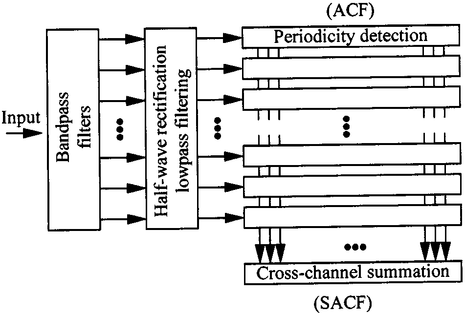
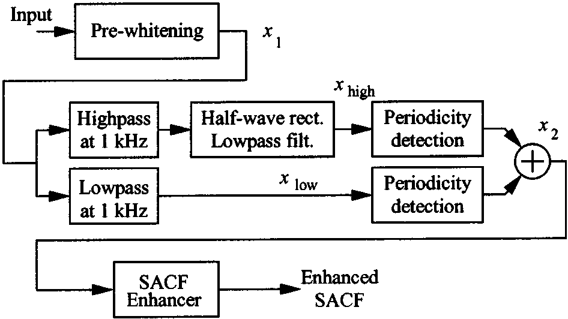
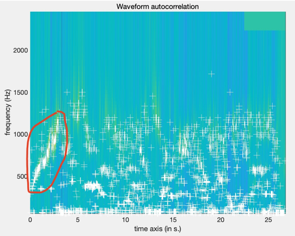
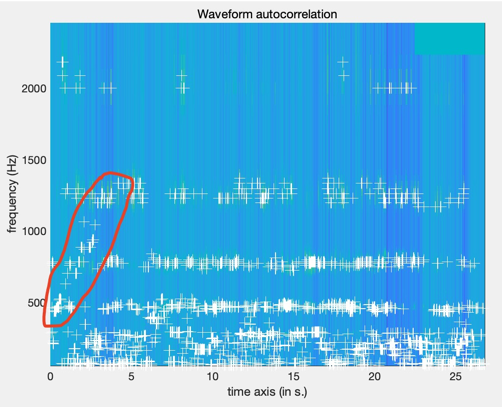
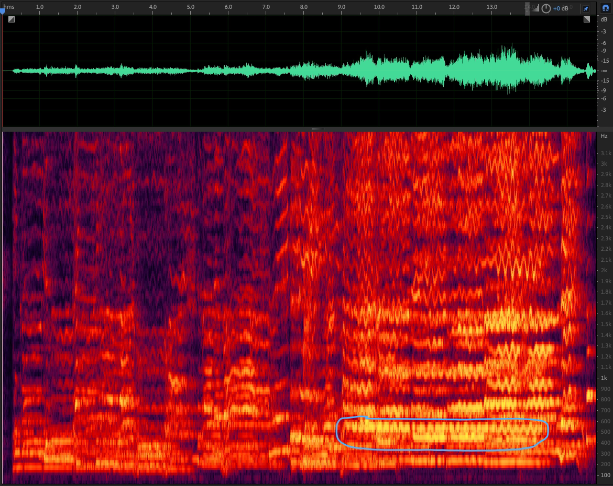
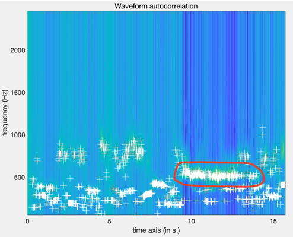
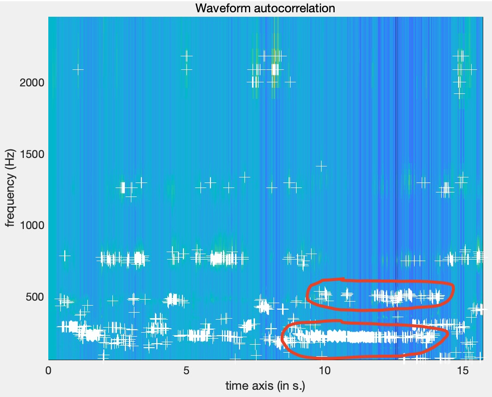

# Audio Program Design and Application - 2

*Reporter : Chuhan Qin  Student Number : 2020209023026  Major : Recording Engineer*

  The function 'mirpitch' in MIRtoolbox is implemented based on the paper: **T. Tolonen and M. Karjalainen, “A computationally efficient multipitch analysis model,” *IEEE Transactions on Speech and Audio Processing*, Nov. 2000, doi: 10.1109/89.876309.**

  In this paper, they made an introduction on Multichannel Pitch Analysis, which uses gammatone filter bank with channels corresponding to the equivalent rectangular bandwidth (ERB) channels of human audition. 



  It was the most common choice before this paper. However, the computational demands of multichannel pitch analysis systems have prohibited their use in practical applications where typically real-time performance is required, and the computational requirements are mostly determined by the number of channels used in the filterbank. In this way, they proposed a  a simplified model of pitch perception, which  is more suitable in practical applications and still qualitatively retains the performance of multichannel systems. And the simplified model is just the same as the algorithm of function 'mirpitch' in MIRtoolbox. Its block diagram was also given in this paper:



  The first block is a pre-whitening filter, which is implemented using warped linear prediction (WLP). And WLP is described in paper: **U. K. Laine, M. Karjalainen, and T. Altosaar, “Warped linear prediction (WLP) in speech and audio processing,” *International Conference on Acoustics, Speech, and Signal Processing*, Apr. 1994, doi: 10.1109/icassp.1994.390018.** It is used to remove short-time correlation of the signal. Besides, WLP technique works as ordinary linear prediction except that it implements critical-band auditory resolution of spectral modeling instead of uniform frequency resolution, and can be used to reduce the filter order considerably. 

  The main improvement of this algorithm is the middle part of this diagram. The signal is seperated into two channels, below and above 1kHz, instead of the gammatone filter bank. In addition, the high-channel signal is half-wave rectified and lowpass filtered with a similar filter to that used for separating the low channel. Then, their periodicity detection is based on “generalized autocorrelation,” whose computation is obtained as:
$$
x_2=IDFT(|DFT(x_{low})|^k)+IDFT(|DFT(x_{high})|^k)
$$
  The parameter $k$ is just the same as MIRtoolbox's 'Compress', which determines the frequency domain compression. In the two-channel case,  the low channel is phase-insensitive due to the autocorrelation. However, the high channel is phase-sensitive since it follows the amplitude envelope of a signal in the frequency band above 1000 Hz. Thus, all phase-sensitivity in their model is inherently caused by the high channel. 

  From what has been discussed above, it is obviou that the main improvement made by T. Tolonen and M. Karjalainen, is that they use two-channel to replace multichannel and still qualitatively retains the performance the multichannel systems. So, in this report, I would like to compare these two methods and discuss their performance in pitch analysis.


  Fortunately, MIRtoolbox's function 'mirpitch' also provides the multichannel pitch analysis model:  


  If we use 'Gammatone' here, it will become the multichannel model instead. Both multichannel and two-channel model in T. Tolonen and M. Karjalainen's paper are based on autocorrelation computation, so function 'mirpitch' also provides parameters for peak picking:


  The default value of lowest pitch taken into consideration is 75 Hz. It means that most bass instruments will be ignored resembling bass guitar, drum. So if we wanna detect such instruments in signals, it's necessary to modify this parameter. And in the explanation of parameter 'Max', the manual has clearly told that 'mirpitch' is implemented without pre-whitening, which brings some problems with higher frequency. I tried to implement WLP filter by myself but I didn't find any content about it on the Internet, then suddenly, I realized that I can use chatGPT to see if it can implement this demand. So, this is what it gave me:

```matlab
function [a, E] = warped_lpc(x, fs, order, warp_factor)
% x: input signal
% fs: sampling frequency (Hz)
% order: order of the prediction filter
% warp_factor: warping factor

% Pre-emphasis filter
preemph = [1, -0.95];
x = filter(preemph, 1, x);

% Compute autocorrelation coefficients
[r, lags] = xcorr(x, order, 'coeff');

% Warping function
omega = (0:order)' * pi / order;
freq_warp = tan(warp_factor * omega) / tan(warp_factor * pi);

% Construct the Toeplitz matrix
R = toeplitz(r(order+1:end-1));

% Construct the right-hand side vector
g = -r(order+2:end);

% Apply frequency warping
freq_warp = freq_warp(2:end);
R = diag(freq_warp) * R * diag(freq_warp);
g = g .* freq_warp;

% Solve the linear system of equations
a = [1; -pinv(R) * g];
E = r(1) + g' * a;

% Check the stability of the prediction filter
if max(abs(roots(a))) >= 1
    error('Prediction filter is unstable.');
end

end
```

  Um...Acutually, I think that's really unreliable because the input parameter 'fs' hasn't been used in whole function. What's more ridiculous, it made incorrect use of multiplication. 


  And I asked chatGPT some knowledge about Warped Linear Prediction(WLP) filter,  chatGPT confused Warped Linear Prediction with Weighted Linear Prediction filter. And sometimes chatGPT would implement Warped Linear Prediction filter with MFCC, in the reason of both WLP and MFCC are nonlinear processing, which is such a fallacy. In this way, I believe that 'chatGPT will replace the programmers' is ballshit. Whatever GPT-4 or GPT-5, deep learning model's generalization ability couldn't cover all specific needs. So silly for the people who believe that artificial intelligence would snatch away their jobs.

  Anyway, let's get back to the comparison of two-channel and multichannel method. Again, I encapsulated a function so that it is more convenient to modify the parameters which I would like to use. First of all, I use a audio signal which contains two timbres made by myself, and its spectrogram is as shown in the figure below:


  When I use two-channel model, 'mirpitch' gives the figure as:


  When the multichannel model is as shown below:


  Obviously, they have many differences, which are caused by the number of channels. I will analyze them after all the figures have been given. Next is an audio signal of chorus, which contains different voice parts. Its spectrogram is:


  And the two-channel model's result is:


  Multichannel model:


  Then I also use an audio of ensemble, which contains many parts. Its spectogram is shown as:


  The detection result of two-channel:


  Multichannel:


  基于以上结果，我们可以进行进一步的分析与总结，实际上两种模型的提取结果差异相当明显。如前文中给出的论文中所述，双通道模型的高通通道与多通道模型中各通道一样，都需要经过半波整流和低通滤波，而低通通道则并不需要。也正因为双通道模型的这一特征，导致了高通通道和低通通道对基频提取的贡献程度不同，摘自论文原文：

  '*When a tone with a fundamental frequency higher than the crossover frequency is analyzed, the SACF is dominated by the contribution from the high channel. The high-channel compressed autocorrelation is computed after the low-pass filtering at the crossover frequency, thus, the high-channel contribution for fundamental frequencies above the crossover frequency is weak.*'

  我认为这意味着双通道模型对高于1 kHz的基频提取能力较弱，从上面给出的图像结果也可以看出，利用双通道模型提取出的1 kHz以上的音高十分混乱，几乎没有可辨认的基频曲线；而传统的多通道模型则可以一定程度上稳定提取出更高频段的音高内容。与此同时，也是由通道数量导致，利用多通道模型得到的基频曲线是按照频段给出的，因此其经常会在多个频段出现可能的峰值点，它得出的曲线相对会更“平直”。接下来我尝试调用‘mirpitch’函数的‘Mono’参数，只留下一个最优峰值点，此处只以ensemble.wav文件为例对比：


  可以看到，去掉多余峰值点后，曲线的整体分布没有改变，但是脉络变得更加清晰了。从原始音频的声谱图可以看到，其在1 kHz以上有着明显基频线分布，而在双通道模型给出的结果中依然没有很好地反映出这一特征，这也证实了论文中给出的结论，双通道模型的确对1 kHz以上的频段检测效果较差。而在1 kHz以下，尤其是800和500 Hz附近，多通道模型存在着两道持续的基频分布，原始合奏音频的声谱图过于复杂，为了更清晰地观察基频和谐波分布，我将声谱图进行放大进一步比较：


  似乎并不存在这两道基频曲线，并且从听感上来分析并没有哪个乐器从头到尾的音高都保持在一条线上，所以可以看出这也是多通道模型的一个缺陷。

  但在开头的时候有一段弦乐演奏的音高是保持上升的，这一特征很好辨别，可以基于这个特征看看两种方法提取的结果：双通道模型明显对这一特征的提取效果要优于后者。而这也引出了我的另一个结论：双通道模型对1 kHz以下的基频提取能力要远优于多通道模型。



  这一结论从duet.wav的提取结果可以很明显的看出来，两者都没能提取出高频段的基频，但明显双通道模型对低频段低频曲线的提取要优于多通道模型：


  这很明显是Gammatone滤波器组对1 kHz以下的频率划分成太多频段所导致，不仅计算量上升，也让低频（同时也是大部分基频主要分布的频段）的连贯性变得不好。双通道模型改善了这一问题，尽管这也导致了高频段的提取效果下降。对于第二条音频，一条合唱信号，从其提取结果来看，依然是双通道模型的提取效果更好：






  From what has been discussed above, I personally believe that two-channel pitch analysis doesn't only reduce the computational amount, but provides a better detection in the frequency band below 1 kHz. This is really interesting, probably we can have another improvement based on this model resembling using multichannel above 1 kHz, to further strengthen the detection of the frequency band above 1 kHz. However, I still can't be sure if this could be influenced by WLP filter. Because until now, I haven't find the implementation of it yet. **Laine.** only gave the 1st and 2nd order as the example but in the paper of Tolonen and Karjalainen, they used 12th order which is impossible to implement by myself.


---

  Rhythm detection is an interesting and multifarious research direction. It has so many different algorithms   resembling Predominant Local Pulse which is the method provided by librosa, beat period estimation and even some models based on Deep Learning. I have used a CRNN model named BeatNet, the paper of it is: **H. Mojtaba, C. Frank, and D. Zhiyao, “BeatNet: CRNN and Particle Filtering for Online Joint Beat Downbeat and Meter Tracking,” *Cornell University - arXiv*, Aug. 2021, doi: 10.48550/arxiv.2108.03576. **The model is open-sourced on Github and I used it because BeatNet can even estimate the beats and downbeats precisely. In this way, we can know that Rhythm Detection technical is very mature now.

  Back to MIRtoolbox's function 'mirfluctuation', which is based on the paper: **E. Pampalk, A. Rauber, and D. Merkl, “Content-based organization and visualization of music archives,” *ACM Multimedia*, Dec. 2002, doi: 10.1145/641007.641121.** Its detection process is shown as the below figure:


In this way, 'mirfluctuation' also provides such parameters for us to modify:


  Obviously, if we don't add parameter 'Summary', 'mirfluctuation' won't sum the resulting spectrum across bands, then we can only extract the bands that we want. That's because people prefer to take the perception of low frequency as the rhythm.

  In this way, actually we have two ways to extract the rhythm using 'mirfluctuation'. In the first method, I add parameter 'Summary' and find the its peaks directly, using the amplitude of the peaks as beats per second, then multiplying it with 60 to output the result BPM. In the other method, I don't add parameter 'Summary' but try to extract the low parts of the spectrum, then finding the lower parts' peaks and doing the similar thing as above to output the BPM.

  Besides, I use two method to get the reference BPM. One of them uses librosa function 'beat_track':


  And I put the .py file in my homework fold as well, which demands you to install numpy and librosa before running it. Anothe method is based on a free website: [https://www.freejishu.com/tools/bpm.html]


  You can just beat the keyboard with musical perception, which is absolutely the most accurate and easiest way to detect the rhythm. 

  The music signal is still the ensemble wave file, which has been used above. The detection result of ***librosa.beat.beat_track*** is shown below:


  The detection result tested by myself is shown as:


  In this way, we can use 'mirfluctuation' to extract the rhythm and check the accuracy of result according to the references above. From the paper of E. Pampalk, A. Rauber, and D. Merkl: '*at the end of the feature extraction process each piece of music is represented by a 20*×*60 matrix*'. So function 'mirfluctuation' only returns a matrix, which means that it still needs some post processing to extract the final BPM. In this way, I  encapsulated another function to implement whole complete process.

  After many attempts, I realized that the accuracy of 'mirfluctuation' actually depends on the set of peaks picking's threshold, whether to add the parameter 'Summary' or not. In this way, I repectively found the best thresholds for these two method:


  

  Besides, I also tried 'mirbeatspectrum', but it didn't give the ideal result. Even if I change the parameters of peaks peaking, the result still didn't improve any more. Anyway, I think beat spectrum's method is similar with fluctuation, both of them are based on autocorrelation.


---

  Above all, I have implemented the melody and rhythm extraction based on function 'mirpitch' and 'mirfluctuation' in MIRtoolbox. Besides, all files are saved in my homework folder, including .m files, .py files and audio files.