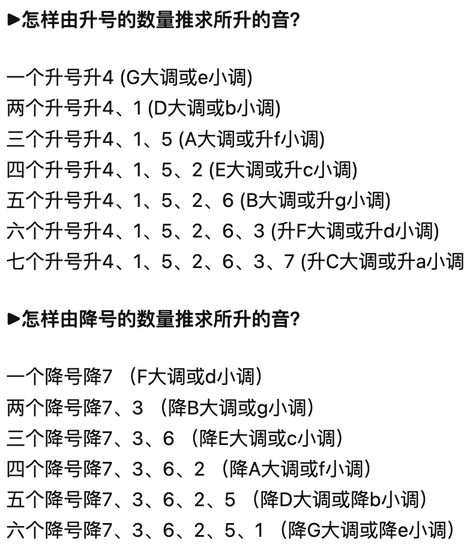

# Audio Program Design and Application - 3

*Reporter : Chuhan Qin  Student Number : 2020209023026  Major : Recording Engineer*

  Three functions have been given in the class, whose names are 'mirkey', 'mirmode' and 'mirtonalcentroid'. Although they are put together, actually, the first two are from the thoughts of PCP and Chromagram when 'mirtonalcentroid' is individually implemented from the paper: ***C. Harte, M. Sandler, and M. Gasser, “Detecting harmonic change in musical audio,” Oct. 2006, doi: 10.1145/1178723.1178727.***  Both function 'mirkey' and 'mirmode' are implemented based on function 'mirkeystrength', which computes correlation coefficients between the chromagram and returns a matrix(in frame decomposition mode) like the figure below:


  It reflects each frame's probability of all tonality candidates. In this way, we can intuitively associate the way to compute the tonality of this music signal, for example, making the tonality candidate with the most frequent high probability as the final result. Besides, the key profiles are used to compute the keystrength firstly proposed in the paper: **C. L. Krumhansl and E. J. Kessler, “Tracing the dynamic changes in perceived tonal organization in a spatial representation of musical keys.,” *Psychological Review*, Jul. 1982, doi: 10.1037/0033-295x.89.4.334.** In this way, we can know about that the key profiles are derived from subjective evaluation experiments but not completely music theory.

  Anyway, function 'mirkey' will return us three values: 

*(1)the best key(s) has/have been estimated;*

*(2)the key clarity which could be used to judge the result's reliability;*

*(3)the mirkeystrength data which has been talked about above.*

  If we add parameter 'Frame' to 'mirkey', it will complete the above process with a frame decorposition. We would compare their results' difference later.

  After that, function 'mirmode' continues to use the keystrength as well. It estimates the madality of music signal and returned as a numerical value between -1 and +1: the closer it is to +1, the more major the given excerpt is predicted to be, the closer the value is to -1, the more minor the excerpt might be. Actually, function 'mirmode' estimates the madality by computing the key strength between the best major key and the best minor key, so it mainly uses the subtraction to achieve this goal:


  From what has been discussed above, the two functions could be used for our demand of detecting mode and tonality. I will analyze totally five music signals in this report, which are all found on **FreeSound**(https://freesound.org/). FreeSound is a collaborative database of Creative Commons Licensed sounds. Browse, download and share sounds. By the way, it is developed by the Music Technology Group of Universitat Pompeu Fabra. The five signals are all labeled with their modes and tonalities on their download pages, so it's very convinient for us to analyze them.

  I encapsulated only two functions in this homework, however, it actually caused more programming work for me because there are many different conditions need to be disscussed, especially the six dimensional tonal centroid. I will analyze it meticulously in the following report. 

  Now back to the function 'mirkey' and 'mirmode'. In the function encapsulated by me, I combine these two MIRtoolbox functions  to detect the key and modality of music signal. Firstly, function 'mirmode' will establish the modality according to the keystrength. Then, based on the result of 'mirmode', we can get further information of the tonality:

```matlab
...
[k, c, s] = mirkey(path);
K = mirgetdata(k);
...
Modality = mirmode(path, 'Best')
if mirgetdata(Modality) > 0
    Modality = 'Major';
else 
    Modality = 'Minor';
end

key = string(["C M", "C# M", "D M", "D# M", "E M", "F M", "F# M", "G M", "G# M", "A M", "A# M", "B M", "c m", "c# m", "d m", "d# m", "e m", "f m", "f# m", "g m", "g# m", "a m", "a# m", "b m"]);
if strcmp(Modality, 'Major')
    Key = key(K);
elseif strcmp(Modality, 'Minor')
    Key = key(K+12);
end
...
```

  Obviously, function 'mirmode' and 'mirkey' are combined for detecting the tonality in the function encapsulated by me. Besides, I also considered the difference may caused by a frame decorposition, so there is another implementation:

```matlab
...
[k, c, s] = mirkey(path, 'Frame')
c = mirgetdata(c); k = mirgetdata(k); 
K = mode(k(c>p.Results.ClarityThreshold), 2);
...
```

  I tried to average the results of each frame, but that's obviouly irrational. It may lead to an inexplicable tonality detection result. So I change it to use the most frequent values in frames, and that's much better. Here I will show the results calculated by them, including the figures and the corresponding tonals and modes as well. 

>#### C Major
>
>*Unframed*
>
>
>
>
>
>*Frame*
>
>
>
>
>
>
>
>#### G Major
>
>*Unframed*
>
>
>
>
>
>*Framed*
>
>
>
>
>
>
>
>#### B Major
>
>*Unframed*
>
>
>
>
>
>*Framed*
>
>
>
>
>
>
>
>#### c# minor
>
>*Unframed*
>
>
>
>
>
>*Framed*
>
>
>
>
>
>
>
>#### g minor
>
>*Unframed*
>
>
>
>
>
>*Framed*
>
>
>
>

  Three of five music signals could be established correctly. The wrong two are respectively G Major and B Major when G Major got a wrong key and B Major got a wrong modality. Besides, framed or not also plays as an important influencing factor. It seems that a frame decorposition will lead to a better result.

  To analyze the reason why G Major and B Major got wrong results, let's have a look at their spectrogram first:

> G Major


> B Major


​    Actually, we can't get any information from their spectrogram about why there is a wrong result. Even if I performed an exhaustive analysis of figures plotted by 'mirkey' and 'mirmode', they provided absolutely only the results but not the reasons. 

  In this way, it seems that the method we used to analyze the problem has encountered a bottleneck. That's why we introduce the **Tonal Centroid**, which provides us a completely different perspective to look at this problem. In the paper of *Christopher Harte* and *Mark Sandler*, before the formal introduction of tonal centroid, they told about the models for Tonal Space. It actually is based on the Harmonic Network(or Tonnetz), which is as the figure shown below:


  The Harmonic Network shows important pitch relations: Lines of fififths travel from left to right, lines of major thirds travel from bottom left to top right and lines of minor thirds travel from top left to bottom right. The Harmonic Network is an infinite plane. If it is assumed that a particular note spelling on one row is equivalent to the same note spelling on the next row, the plane wraps up and forms a tube with the line of fifths becoming a helix on its surface, the plane wraps up and forms a tube with the line of **fififths** becoming a helix on its surface. In the case where the helix is wrapped so that **major third** intervals are directly above each other on the surface of the tube. Based on the thought of the Hamrmonic Network, if we replace the theoretically infinite number of pitch names with twelve different pitch classes, this has the effect of joining the two ends of the tube together and the result is a **hypertorus** with the circle of fififths wrapping around its surface three times.  Then the Hypertorus is just as the figure shown below:


  In my opinion, this actually takes advantage of the thought of dimensional decreasing. Firstly, it converts the infinite dimensional Tonnetz (proposed from: **H. Longuet-Higgins. Second Letter to a Musical Friend. The Music Review, 23, 1962.**) to the 12-dimensional pitch classes (Chromagram) by assuming enharmonic equivalence. Then *Christopher Harte* and *Mark Sandler* tried to further reduce the dimensionality according to the Hypertorus which has been mentioned above. They proposed a 6-dimensional interior space contained by the surface of the Hypertorus and decomposed it into three 2-dimensional circularities in the tempered Tonnetz(Harmonic Network). In this way, we can just put the tonal centre of music signal into these three 2-dimensional plane and calculate the distance to get the tonality:


  Isn't it clear enough? The three circles above are just three different perspectives of Hypertorus. And as what has been discussed above, the Hypertorus is the projection of the Harmonic Network after dimension reduction. Based on this model, we can establish music signal's tonality by calculateing its tonal centroid and mapping to these three planes. Then measuring the distance between the tonal centroid and each point repectively. *Christopher Harte* and *Mark Sandler* finished the above operation through the following process:


  Please ignore the HCDF computing for now, let's focus on the process from Audio to 6D Centroid Vectors. Firstly, they used Constant-Q Transform to extract a 36-dimensional feature from the audio signal. Then, the Chromagram, which has already been discussed above, is used to reduce the feature's dimensionality from 36 to 12. This step actually contains the thought which is proposed by me before, we can just regard this 12-bin Tuned Chromagram as a model, which comes from the dimension reduction of Harmonic Network.


  为防止表述不清晰，我这里用中文加以补充叙述。从我个人观点来看，调性质心真正的核心思想是对特征参数的降维。首先其根基是最早由*Richard Cohn*提出的谐波网络模型(Harmonic Network)，这一模型从原理上展现了不同调性之间的音程关系，但其最大的缺点是维度较高，*Christopher Harte*和*Mark Sandler*原文给出的原话是：*'In Just Intonation, the Tonnetz is an infifinite plane.'* 由此可以看出我们无法直接利用这一模型，因此就有人提出邱氏螺旋阵列 (Chew’s Spiral Array) ，将其从一个平面模型转换成一个三维空间模型，其实际在三维空间中表现为一个管道，即前文所说的Hypertorus。

  这个管道的表面分布有12个不同的点，对应十二平均律里一个八度内的十二个音，其实原本的谐波网络模型也只是这十二个音的无限延拓，邱氏螺旋阵列相当于把这样一个平面模型给“卷起来”了 (更形象的表述为wrapped)，从而将无限维的特征降低到十二维。这也刚好对应Chromagram的十二个Pitch Class Profile。

  以上所述内容都是*Christopher Harte*和*Mark Sandler*之前文献的研究成果，而他们在这篇文章中真正做的事是：

  *We now propose a 6-dimensional interior space contained by the surface of the Hypertorus. This allows us to apply the same technique that Chew uses to develop the Centre of Effect in the Spiral Array to this equal tempered model for pitch space.*

  他们在邱氏螺旋阵列的基础上又提出了一个六维模型，对原本的十二维再次进行了降维。但实际上他们并没有额外进行什么其他的建模，因为此六维模型就是Hypertorus表面十二个点在三个不同方向上的投影。

  上面所说内容都是关于文献中平面坐标里的三个圆是怎么来的，也就是这一模型本体是如何通过一步步降维得到的；而在文献一开始给出的计算流程则是模型输入信号的处理流程，其核心思想也是通过降维，把信号的特征映射至模型的六维空间中。以下是我根据自己的理解制作的一个流程图：


  基于上述说明，完整解释了调性质心的特征原理及其所基于的思想。前面我们主要碰到的问题是在使用函数'mirkey'和'mirmode'分析调式时G Major和B Major两个音频文件的调和调式分别提取错误，但是缺少不同角度的方法对问题进行具体分析。因此在接下来的报告中，我们会利用调性质心进一步地对问题进行探索。


---

  In my homework folder, I implemented a function named 'circle_plot.m'. It is exactly as the three circles described in *Christopher Harte* and *Mark Sandler* 's paper. Besides, it also calculates the euclidian distance between the tonal centroid and each point of three circles. Although we have talked much about tonal centroid, it isn't the original purpose of Harte and Sandler. Actually, they introduced the tonal centroid for another feature: HCDF, whose full name is Harmonic Change Detection FunctionI. It is used for detecting changes in the harmonic content of musical audio signals:


  And its calculation formula is:
$$
ξ_n = \sqrt{\sum^5_{d=0}[ξ_{n+1}(d)-ξ_{n-1}(d)]^2}
$$
  where $n$ refers to the frame location, so $ξ_n$ is the euclidian distance between the tonal centroid vectors $ζ_{n−1}$ and $ζ_{n+1}$ 

  However, I think Harte and Sandler actually ignored the importance of tonal centroid itself. It is absolutely not only a calculation factor but can reflect the tonal characteristics of the signal to a great extent. This is what we can improve in the future research about Tonality Detection.

  Anyway, the analysis results are shown below:

> #### G Major
>
> *Unframed*
>
> 
>
> 
>
> 
>
> *Framed*
>
> 
>
> 
>
> 
>
> 
>
> #### B Major
>
> *Unframed*
>
> 
>
> 
>
> 
>
> *Framed*
>
> 
>
> 
>
> 

  Based on music theory of tonality, I summarized the scales of all majors and minors. Actually there are totally twenty-eight tonalities:



  I ignored the C# major, a# minor, Gb major and eb minor because of the repeated tonics. In this way, there are totally twenty-four tonalities have been summarized:


  (I will put this csv file into my homework folder as well.)

  Based on the summarization above and the euclidian distance between tonal centroid and tone points, I'm here to presume boldly, a new algorithm could be proposed to detect the tonality. The calculation process I envisioned is as follows:

> *(1) Sum the euclidian distance between tonal centroid and each tone point of three circles, for example:*
>
> 
>
> (2) *Take the inverse of each element in the vector. Then we will get a 12-dimentional vector.* 
>
> *(3) Pre-process the twenty-four tonality vectors. Here I give more weights to the key of each tonality vector:*
>
> 
>
> *(4) Calculate the correlation between the distance vector and above twenty-four 12-dimentional tonality vectors. Both cross-correlation and dot product are worth trying.*
>
> *(5) Take the vector with greatest correlation as the final tonality detection result.*

  Untill now, I have implemented the above processing steps in Matlab and saved them in my homework folder. So there are two extra '.m' files which named as 'Tone_EuclidianDistance_Calculate.m' and 'Correlation_Calculate.m'.

  However, after many attempts and modifications, it seems that the above process unable to give a satisfactory result. In my opinion, the core of this algorithm is the extraction of signal's tonal centroid.  I believe that the main reason why this method failed to achieve the desired effect is that there are some frames that provide a confused tonal centroid. So, to optimize its effect, we'd better add more features that could help us extract the tonal centroids with higher confidence.


  *Christopher Harte*和*Mark Sandler*文献中利用Tonal Centroid主要的目的是基于不同帧调性质心的欧几里得距离之间的区别，从而映射为调性稳态的特征。但他们忽视了利用调性质心欧几里得距离这个特征本身，与Chromagram类似的，同样也可以在一定程度上反映出音乐信号每一帧的调性特性。我的改进思路是，既然Tonal Centroid是由Chromagram降维而来的，理论上两者拥将有相似的特性，而Chromagram得到Keystrength的方法是与所有的Key Profile进行互相关计算，所以我根据所有调性各自的音阶也总结出了一个类似Key Profile的矩阵，并将其与Tonal Centroid的欧几里得向量进行相关性计算（不一定是互相关）。

  上面的内容中提出了我个人对Tonal Centroid的理解并给出了一些算法的改进意见，并对相关内容进行了Matlab实现。但是目前碰到的瓶颈是特征量较少，导致提取结果并不理想，后续想要对本算法加以改进应当从调性稳态检测以及调性质心与调性音程映射关系等方向入手，尝试融合更多音乐学相关理论的内容，从而加以利用调性质心的特性。


---

  综上，我将所有的音频文件、.m文件和.csv文件都放在了我的作业文档中，并对相关内容进行了记录与总结，留待进一步的research。