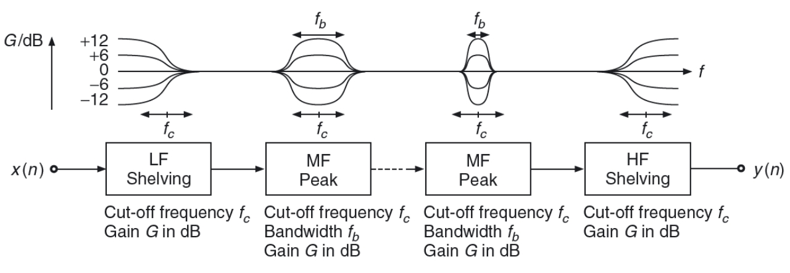
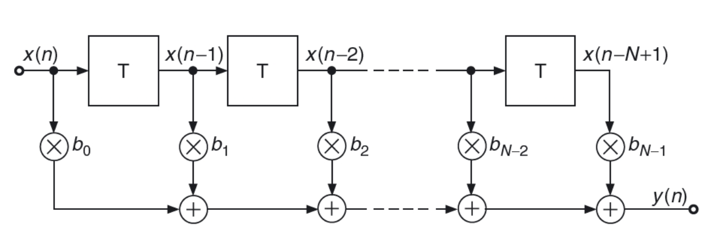
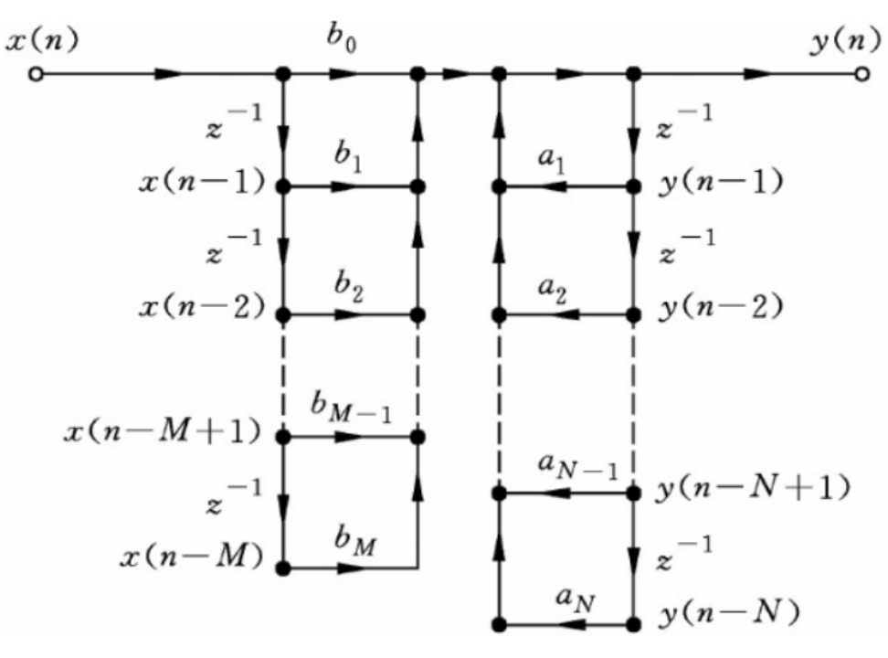
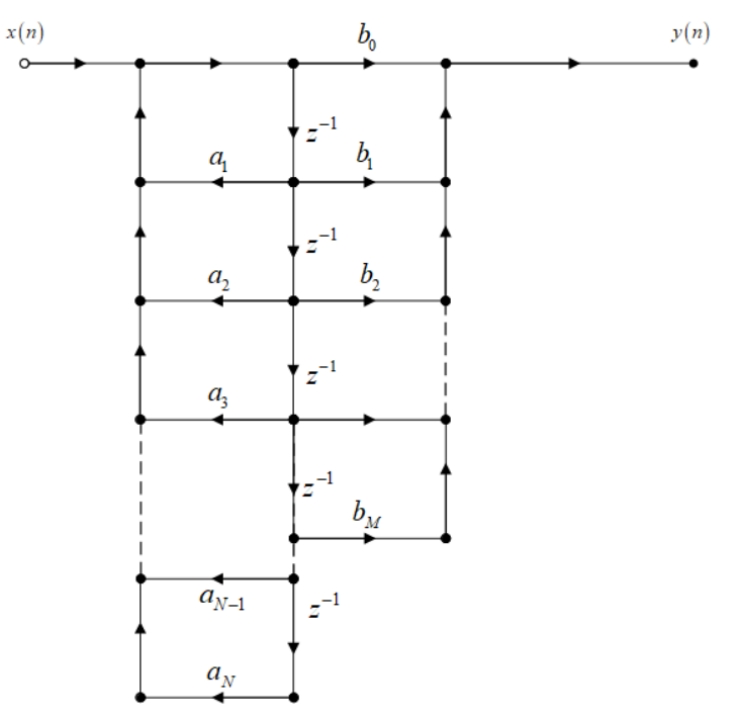
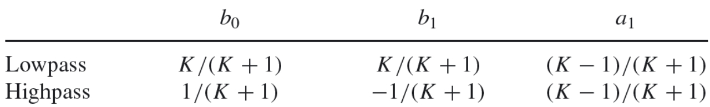
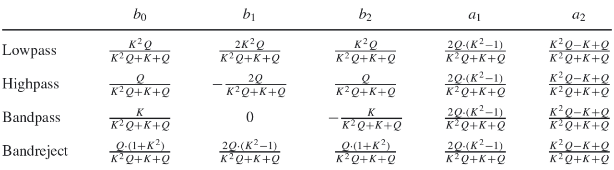

# Audio Program Design and Application - 5

*Reporter : Chuhan Qin  Student Number : 2020209023026  Major : Recording Engineer*

  Equalizer, which is the most widely used digital audio effect , is actually the basic component of many complex audio effects, such as delay, vibrato, flanger, doubler, reverb, etc.  In some ways, equalizer can be seen as an extension, or combinations, of filters. In our course, there is a picture from DAFX which clearly shows the main filter categories used in equalizer : LowPass/HighPass shelving filters and Peak filters. The picture is as following:

  But these filters are not the keynote of this report. To design such filters, we must know the different construct of basic filter. In the course of last term, we studied FIR/IIR filter and their difference in pole-zero plot. However, the pole-zero plot is only an analytical perspective which cannot be used to explain the reason. Actually, explaining thier predominant difference can start with their structures and formulas. 

  For FIR filter, it has only one direct form, whose diagram and formula are as following:

$$
y(n) = \sum^{N-1}_{i=0}b_i·x(n-i) \\
=b_0x(n)+b_1x(n-1)+...+b_{N-1}x(n-N+1)
$$
  For IIR filter, its structure involves direct form I and II, and the diagrams and formulas are as following:

> Direct Form I

$$
y(n) = \sum^{N}_{i=0}b_i·x(n-i)+\sum^{M-1}_{i=1}{a_i·y(n-i)}
$$

> Direct Form II

$$
x_h(n)=x(n)-a_1x_h(n-1)-...-a_Nx_h(n-N) \\
y(n)=b_0x_h(n)+b_1x_h(n-1)+...+b_Mx_h(n-M)
$$
  Obviously, the main difference between FIR and IIR is the feedback in the structure of IIR, which causes that not all the poles of IIR filter locate at the origin. And the direct form II of IIR is also called Canonical Filters, which demands the least amount of delay units. In order to simplify the debugging complexity of high order filters, we usually decomposed the high order filter into a combination of multiple first or second order canonical filters. That's why most articles and books only provide the design formulas of first and second order filters, including some more complex filters such as wraped linear prediction filter.

  In this report, we mainly focus on designing different types of FIR filters and IIR canonical filters, resembling bandpass filter. Matlab provides many functions for filter designing and I use the function *fir1* to get the impulse response of FIR highpass filter, bandpass filter and bandstop filter. Then I use the coefficients for first and second order canonical filters in DAFX, to implement the first-order highpass filter and second-order highpass canonical filter, bandpass canonical filter and bandstop canonical filter. At last, I plot their frequency response and phase response with function *freqz* in Matlab, then using function *filter* and the coefficients of them to filter the audio signal.

  Function *fir1* in Matlab is actually based on least-squares approximation to compute the coefficient and smooths the impule response with window which has been discussed in our course:

  By windowing the impule response, the gain of filter's pass-band has less fluxtuations and stop-band attenuation becomes more obvious, while it also introduces some delay to the filter system. Through the use of function *fir1*, we needn't to implement the additional windowing operation and its algorithm is certainly more robust. So *fir1* is the best choice for us to finish this part of work. 

  Function *fir1* mainly has three parameters for us to revise if we wanna FIR filter with different order, cut-off frequency or type. Wherein the unit of cut-off frequency parameter $W_n$ of *fir1* should be strictly greater than 0 and smaller than 1, where 1 coresponds to the Nyquist frequency. And $W_n$ can be seecified as a scalar, a two-element vector or a multi-element vector. When $W_n$ is a multi-element vector, *fir1* will return an multiband filter which is a really convenient method.

  Here I test an audio signal which has been used in the past reports. And I compute the FFT of original signal and filtered signal to show the difference caused by the filter. the result of FIR filter is shown as following:

> HighPass FIR
>
> Cut-off Parameter: 0.3

> BandPass FIR
>
> Cut-off Parameter: 0.4~0.55

> BandStop FIR
>
> Cut-off Parameter: 0.05~0.3

  To better perform the FFT results of them, I normalize the amplitude spectrum with the function *normalize*   and it clearly reflects the changes caused by FIR filter. Both the spectrums of highpass and band pass filter appear a strange hump around 10kHz, that's because the predominant frequency components of origninal signals have been filtered out and the components that were orginally very small become relatively larger. From the sense of hearing, the highpass and bandpass filter has indeed filtered out the predominant frequency which even makes nothing can be heard.

  For IIR canonical filters, our course has produced us the coefficient computing formulas, which are shown as follows:

  In this way, what we need to do is only implement them in Matlab. So I encapsulate a function named 'IIR_Designer', which implements all the formulas above and filtering the input audio signal with a comparison of the spectrums as well . The result of them are as the following:

> First Order Highpass
>
> Cut-off Frequency: 1.5 kHz

> Second Order Highpass
>
> Cut-off Frequency: 1.5 kHz

> Second Order Bandpass
>
> Cut-off Frequency: 11400 Hz
>
> Band Width: 3600 Hz

> Second Order Bandstop
>
> Cut-off Frequency: 4.2 kHz
>
> Band Width: 6 kHz

  IIR filters' phase response are nonlinear, which differs from FIR filter. From the figures of frequency response, obviously, second-order filter has better attenuation in stopband than first-order. Even analyzing in hearing perception, it's pretty obvious that second-order has better effect. 

  为了更好地对比IIR和FIR带通带阻滤波器之间的听感区别，我特意将二阶典范带通和带阻滤波截止频率与带宽设置的和FIR基本一致，从听感上来分析，典范滤波的带通没有像FIR那样完全干净的滤除，还是保留了一些可闻的谐波成分，从它的频率响应上就可以看出，其阻带的衰减不像100阶的FIR滤波器那样显著；典范带阻滤波器同样也没有100阶的FIR滤波器阻带衰减那么明显，同时相对而言最大阻带要窄很多，曲线的形状就跟FIR滤波器不同，是内凹的而非类似矩形的形状。上述是对100阶的FIR滤波器和2阶的典范滤波比较，尽管如此2阶的典范滤波已经效果非常不错了，可以看出对于同样的设计指标，IIR滤波器设计的阶数要求要相比FIR小很多。

---

  综上所述，完成了对FIR和典范滤波器的实现，并计算了相应的频率和相位响应，同时对音频进行了滤波和效果分析，综合对比了不同结构滤波器之间的差异。

  (这周真的太赶了，写到凌晨四点才写完全部报告和代码，若有部分缺漏的地方敬请谅解